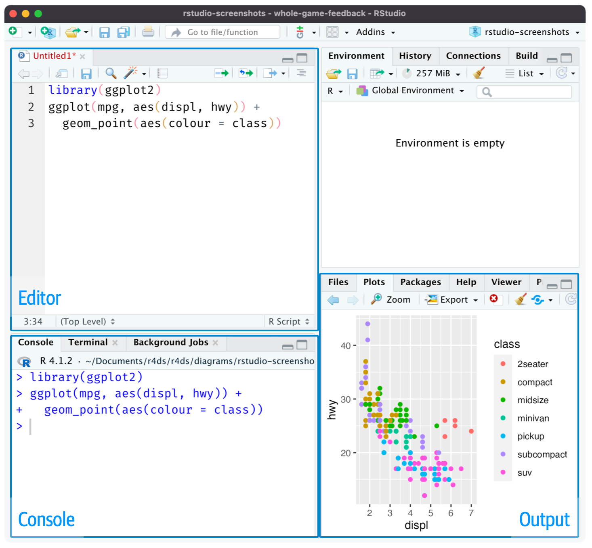
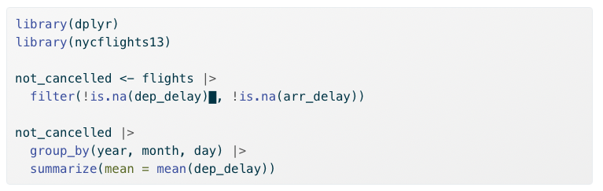

# Intro to R and RStudio {#sec-installingR}

```{r}
#| echo: false
#| output: false
#| message: false
#| warning: false

library(tidyverse)

```

```{=html}

<style>
.problem {
    background-color: #f8f9fa;
    border: 1px solid #dee2e6;
    border-radius: 8px;
    padding: 20px;
    margin: 20px 0;
}
.context {
    background-color: #e8f4f8;
    padding: 12px;
    border-radius: 5px;
    margin-bottom: 15px;
    border-left: 4px solid #2874a6;
}
.question {
    margin: 15px 0;
    padding: 10px;
    background-color: #fff3cd;
    border-radius: 5px;
}
.answer-row {
    display: flex;
    align-items: center;
    margin: 10px 0;
    flex-wrap: wrap;
    gap: 10px;
}
.answer-row label {
    min-width: 320px;
    font-weight: 500;
}
select {
    padding: 8px 12px;
    font-size: 14px;
    border: 2px solid #ccc;
    border-radius: 5px;
    min-width: 300px;
    cursor: pointer;
}
select:focus {
    border-color: #2874a6;
    outline: none;
}
.correct {
    border-color: #28a745 !important;
    background-color: #d4edda !important;
}
.incorrect {
    border-color: #dc3545 !important;
    background-color: #f8d7da !important;
}
.explanation {
    margin-top: 10px;
    padding: 15px;
    background-color: #e7f3ff;
    border-radius: 5px;
    border-left: 4px solid #2874a6;
}
.note {
    font-size: 0.85em;
    color: #666;
    font-style: italic;
}
</style>

<script>
function checkAnswer(selectElement, correctValue) {
    if (selectElement.value === '') {
        selectElement.classList.remove('correct', 'incorrect');
    } else if (selectElement.value === correctValue) {
        selectElement.classList.remove('incorrect');
        selectElement.classList.add('correct');
    } else {
        selectElement.classList.remove('correct');
        selectElement.classList.add('incorrect');
    }
}
</script>

```


::: {.callout-tip collapse="true"}
## **Key Questions**
- How do I install R and RStudio on my computer?
- What are the main components of the RStudio interface?
- How do I write and run R code?
- What are objects and how do I use them?
- How do I install and load R packages?
:::

::: {.callout-note collapse="true"}
## **Suggested Readings**
- @wickham_r_2023, Ch. 1-3
:::


This appendix will walk you through installing R and RStudio, 
understanding the RStudio interface, 
and writing your first lines of R code.
By the end of this chapter, 
you will be ready to start working with data and running econometric analyses.


## Installing R

To get started with R, you first need to download and install the base R software.
R is available for free from CRAN (the Comprehensive R Archive Network).
Navigate to <https://cloud.r-project.org/> and click the download link for your operating system (Windows, macOS, or Linux).
Follow the installation instructions provided for your system.

Once the installation is complete, 
you will have R installed on your computer.
However, 
we will not typically interact with R directly.
Instead, 
we will use RStudio, 
an integrated development environment (IDE) that makes working with R much more convenient.


## Installing RStudio

RStudio is a powerful IDE designed specifically for working with R.
It provides a user-friendly interface with helpful features like syntax highlighting, 
code completion, 
and integrated help documentation.
You can download RStudio Desktop for free from <https://posit.co/download/rstudio-desktop/>.
The website should automatically detect your operating system and show you the appropriate download link.
Click the link and follow the installation instructions.

::: {.callout-important}
## Only Use RStudio
After installing both R and RStudio, 
you will only ever need to open RStudio.
RStudio runs R in the background, 
so you don't need to open the base R application separately.
Feel free to delete the shortcut for base R from your desktop if you wish.
When you open an R script file (`.R`) for the first time, 
be sure to set RStudio as the default program to open such files.
:::


## The RStudio Interface

When you first open RStudio, you will see an interface divided into several panels (or "panes"),
as seen in @fig-rstudio-interface.
Each panel serves a different purpose in your workflow.
Understanding these panels is essential for working efficiently in R.

:::{#fig-rstudio-interface}



The RStudio interface with its four main panels labeled.

:::

### The Script Editor

The Script Editor is where you write your R code in script files.
A script file is simply a text file containing R code that can be saved, 
edited, 
and run again later.
Working in script files is essential for reproducibility---you can always go back and see exactly what you did, 
make changes, 
and re-run your analysis.
To open a new script file, 
go to File → New File → R Script, 
or use the keyboard shortcut Cmd+Shift+N (Mac) or Ctrl+Shift+N (Windows/Linux).

### The Console

The Console is where R actually executes your code.
When you run code from a script, 
it gets sent to the console line by line.
You can also type code directly into the console and press Enter to run it immediately.
However, 
code typed directly into the console is not saved, 
so this approach is generally only recommended for quick tests or exploratory work.
Output from many functions, 
including regression results, 
will be printed to the console.

### The Environment Panel

The Environment panel displays all the "objects" you have created in your current R session.
These objects might include data frames, 
vectors, 
or stored values.
You can see each object's name along with a brief summary of its contents.
This panel is useful for keeping track of what data and variables you currently have available.

### The Plots and Output Panel

This panel serves multiple purposes.
When you create visualizations (like scatter plots or histograms), 
they will appear here.
This panel also contains tabs for browsing files on your computer, 
viewing installed packages, 
and accessing R's built-in help documentation.

::: {.callout-tip}
## Customizing Your Layout
You can hide or show different panels under the "View" menu.
This is useful when you want more screen space for a particular task, 
such as focusing on your script while writing code.
:::


## Basic Coding in R

Now that RStudio is set up, 
let's write some code!
We'll start with simple operations in the console to get familiar with R's syntax.

### Arithmetic Operations

R can function as a sophisticated calculator.
Try typing the following expressions in the console and pressing Enter:

```{r}
2 + 2
```

```{r}
20 * 5 / 87
```

```{r}
sin(pi / 2)
```

```{r}
sqrt(6)
```

As you can see, 
R can handle basic arithmetic as well as mathematical functions like `sin()` and `sqrt()`.
The `pi` you see in the third example is a built-in constant in R representing the mathematical constant $\pi$.


### Objects and Assignment

R is an "object-oriented language," 
meaning that data, 
variables, 
and nearly everything else is stored as an "object."
You create objects using the assignment operator `<-`.
The assignment operator takes whatever is on the right side and stores it in the name on the left side.

```{r}
x <- 2 + 5
```

After running this code, 
the value `7` is now stored in an object called `x`.
Notice that R didn't print anything---it just stored the value.
To see what's stored in an object, 
type its name and press Enter:

```{r}
x
```

You can use objects in subsequent calculations, 
just like variables in algebra:

```{r}
x + 10
```

You can also update an object by reassigning it:

```{r}
x <- x + 50
x
```

::: {.callout-tip}
## Naming Objects
When creating object names, 
keep them short but descriptive.
Object names cannot contain spaces.
Some good examples include: `flight_data`, `reg_controls_1`, `acs_male`, or `X_mat`.
:::


### Vectors

A vector is the simplest type of object in R.
Vectors contain a sequence of values of the same type (all numbers, all text, etc.).
You create vectors using the `c()` function, 
which stands for "combine":

```{r}
primes <- c(2, 3, 5, 7, 11, 13)
primes
```

One powerful feature of R is that arithmetic operations on vectors are applied element-by-element:

```{r}
primes * 2
```

```{r}
primes - 1
```

You can also perform arithmetic between two vectors of the same length:

```{r}
odds <- c(1, 3, 5, 7, 9, 11)
primes + odds
```


### Functions

R has a large collection of built-in functions that perform specific tasks.
Functions are called using the syntax: `function_name(argument1 = value1, argument2 = value2, ...)`.

For example, 
the `seq()` function generates a sequence of numbers:

```{r}
bb <- seq(from = 1, to = 30, by = 3)
bb
```

Here, 
`from`, `to`, and `by` are the *arguments* of the function.
We set `from = 1` to start at 1, 
`to = 30` to end at 30, 
and `by = 3` to increment by 3.

::: {.callout-tip}
## Getting Help
To learn more about any function, 
type `?` followed by the function name in the console.
For example, 
`?seq` will open the documentation for the `seq()` function.
:::


## Data Types in R

Every piece of data in R has a **type** that determines how it can be used.
Understanding data types is essential because certain operations only work with certain types,
and R will sometimes convert between types automatically in ways that can cause unexpected results.

### Numeric Types

R has two main numeric types:

**Integer** (`int`): Whole numbers without decimal places. Created by adding `L` after a number:

```{r}
my_integer <- 5L
typeof(my_integer)
```

**Double** (`dbl`): Numbers with decimal places (also called "floating point"). This is the default for most numbers:

```{r}
my_double <- 5.7
typeof(my_double)
```

In practice, the distinction between integers and doubles rarely matters for econometric analysis---R handles conversions automatically. When you see `<int>` or `<dbl>` in your data, both are simply "numbers."

### Character Strings

**Character** (`chr`): Text data, always enclosed in quotes:

```{r}
my_name <- "Economics"
typeof(my_name)
```

Character strings are used for labels, names, and categorical data that hasn't been converted to a factor.

### Logical Values

**Logical** (`lgl`): TRUE or FALSE values (can be abbreviated as `T` and `F`):

```{r}
is_enrolled <- TRUE
typeof(is_enrolled)
```

Logical values are often created by comparisons:

```{r}
5 > 3
10 == 10  # Note: == tests equality, = is for assignment
```

Logical values are essential for filtering data (e.g., "keep only observations where income > 50000").

### Factors

**Factor** (`fct`): Categorical variables with a fixed set of possible values (called "levels").
Factors are crucial in regression because R treats them differently from numeric variables:

```{r}
# Create a factor for education level
edu_level <- factor(c("High School", "College", "Graduate", "College", "High School"))
edu_level
```

Notice how R shows the "Levels"---the complete set of possible categories.
Factors are especially important for dummy variables in regression.

::: {.callout-important}
## Why Factors Matter
When you include a factor in a regression, R automatically creates dummy variables for each level.
If you include a character variable, R may treat it as text rather than a categorical variable,
leading to errors or unexpected results.
We will talk more about this in section @sec-dummy-nonlinear.
:::

### Checking and Converting Types

You can check an object's type with `typeof()` or `class()`:

```{r}
class(edu_level)
```

Convert between types using `as.numeric()`, `as.character()`, `as.factor()`, etc.:

```{r}
# Convert character to factor
major <- c("Economics", "Math", "Economics", "Physics")
major_factor <- as.factor(major)
major_factor

# Convert numeric to character
numbers <- c(1, 2, 3)
as.character(numbers)
```

### Common Type Abbreviations

When working with data frames, you'll frequently see these abbreviations:

| Abbreviation | Type | Description | Example |
|--------------|------|-------------|---------|
| `<dbl>` | Double | Numbers with decimals | `3.14`, `2.5` |
| `<int>` | Integer | Whole numbers | `1`, `42` |
| `<chr>` | Character | Text strings | `"hello"`, `"NY"` |
| `<fct>` | Factor | Categorical variable | `factor("low", "med", "high")` |
| `<lgl>` | Logical | TRUE/FALSE | `TRUE`, `FALSE` |
| `<date>` | Date | Calendar dates | `as.Date("2024-01-15")` |
: Common data type abbreviations in R {#tbl-type-abbrev}


### Data Frames

Data frames are the primary way that structured,
tabular data is stored in R.
A data frame is essentially a table where each column is a vector and each row is an observation.
R comes with several built-in data frames for practice,
including `mtcars`,
which contains data on various car models.

Use `head()` to view the first few rows of a data frame:

```{r}
head(mtcars)
```

You can explore the structure of a data frame using several helpful functions:

```{r}
nrow(mtcars)
```

```{r}
ncol(mtcars)
```

```{r}
colnames(mtcars)
```

To access a specific column (variable) within a data frame, 
use the `$` operator:

```{r}
head(mtcars$mpg)
```

Here, 
`mtcars$mpg` extracts the `mpg` column from the `mtcars` data frame as a vector.
I wrapped it in `head()` to show only the first few values.


### Comments

In R, 
anything preceded by the `#` symbol is treated as a comment and will not be executed.
Comments are essential for documenting your code---explaining what each section does, 
leaving notes for yourself, 
or marking areas that need revision.

```{r}
# Find the mean miles per gallon
mean(mtcars$mpg)
```

Good commenting habits make your code readable to others (and to your future self).


## Working with R Scripts

While the console is useful for quick tests, 
you should do the vast majority of your work in script files.
Scripts allow you to save your code, 
edit it easily, 
and reproduce your entire analysis by running the script from top to bottom.

### Creating and Running Scripts

To create a new script, 
go to File → New File → R Script (or use Cmd/Ctrl + Shift + N).
Write your code in the script editor, 
then use the following keyboard shortcuts to run it:

**Cmd/Ctrl + Enter** executes the current line (or highlighted selection) in the console.
The cursor then automatically moves to the next line, 
making it easy to step through your code line by line.

:::{#fig-cursor-script}



Example R script with cursor position shown. Pressing Cmd/Ctrl + Enter will run the complete command that creates the `not_cancelled` object, then move the cursor to the next statement.

:::

**Cmd/Ctrl + Shift + S** runs the entire script from top to bottom.
This is useful for checking that your complete analysis works correctly and produces reproducible results.

### Script Best Practices

Following good practices when writing scripts will save you time and frustration.
Always start your script with your name and a brief description of the script's purpose in comments.
Load all required packages at the beginning of the script using `library()` so anyone reading your code knows what dependencies are needed.
Never include `install.packages()` in your script---you only need to install packages once on your computer, 
and you don't want your script to install packages on someone else's machine without their permission.
Save your scripts with short, 
descriptive names that contain no spaces, 
such as `assignment_3.R` or `ec_325_data_plotting.R`.


## Working Directories

R uses a concept called the "working directory"---the folder on your computer where R looks for files you want to load and where it saves files you create.
You can see your current working directory at the top of the console, 
or by running:

```{r}
#| eval: false
getwd()
```

A good workflow is to save your R script in a dedicated folder for this course (or a subfolder for each week's work), 
put all related data files in the same folder, 
and then set your working directory to that location.
In RStudio, 
go to Session → Set Working Directory → To Source File Location to automatically set the working directory to wherever your script is saved.


## R Packages

R comes with a set of "base" packages that provide fundamental functionality.
However, 
the true power of R lies in its vast ecosystem of user-contributed packages.
These packages extend R's capabilities for specialized tasks---from data visualization to complex statistical modeling.

### Installing Packages

You only need to install a package once on your computer.
Use the `install.packages()` function:

```{r}
#| eval: false
install.packages("tidyverse")
```

### The Tidyverse

The tidyverse is a collection of R packages designed for data science.
These packages share a common philosophy and work seamlessly together, 
making data manipulation and visualization more intuitive.
Some of the most commonly used tidyverse packages include `dplyr` (data manipulation), 
`ggplot2` (visualization), 
and `readr` (reading data files).

Installing `tidyverse` installs all of these packages at once.

### Loading Packages

Once a package is installed, 
you need to load it each time you start a new R session using `library()`:

```{r}
#| eval: false
library(tidyverse)
```

When you load the `tidyverse`, 
you'll see a message listing which packages were attached.
You may also see messages about "conflicts"---this just means some `tidyverse` functions have the same name as functions in base R, 
and the `tidyverse` versions will take precedence.
This is normal and expected behavior.

### The Pipe Operator

One of the most useful features of the `tidyverse` is the **pipe operator**: `|>`.
The pipe takes the result of whatever is on its left and passes it as the first argument to the function on its right.

Think of the pipe like a conjunction in a sentence.
Just as "and" or "then" connect actions in English,
the pipe connects operations in R.
Instead of saying "Take the data, then filter it, then summarize it,"
you write code that reads almost the same way:

```{r}
#| eval: false
data |>
  filter(year == 2020) |>
  summarize(mean_income = mean(income))
```

This code reads naturally from top to bottom:
"Start with `data`, *then* filter to rows where year equals 2020, *then* summarize by calculating the mean income."

Without the pipe, you would need to either nest functions inside each other (hard to read) or create intermediate objects at each step (clutters your environment).
The pipe lets you write code that mirrors how you think about the analysis.

::: {.callout-note}
## Base R Pipe vs. Magrittr Pipe
R now has a built-in pipe (`|>`) that works without loading any packages.
The `tidyverse` historically used `%>%` from the `magrittr` package,
which you may see other people use.
Both work similarly for most purposes.
We'll use the base R pipe `|>` in this course.
:::

::: {.callout-important}
## Remember the Difference
`install.packages()` downloads and installs a package to your computer (do this once).
`library()` loads an already-installed package into your current R session (do this every time you start R).
:::


## Summary and Conclusion

This appendix walked you through the essential first steps for working with R.
You installed R and RStudio, 
learned how the RStudio interface is organized, 
and wrote your first R code.
You now understand how to create and manipulate objects, 
work with vectors and data frames, 
write and run scripts, 
and install packages.

### Key Takeaways

- **RStudio is your interface to R:** Always work in RStudio, not base R. The script editor, console, environment, and plots panels each serve distinct purposes in your workflow.

- **Scripts are essential for reproducibility:** Write your code in script files that you can save, edit, and re-run. Use comments to document what your code does.

- **Objects store everything in R:** Use the assignment operator `<-` to create objects. Vectors hold sequences of values; data frames hold structured tabular data.

- **Packages extend R's capabilities:** Install packages once with `install.packages()`, then load them each session with `library()`. The tidyverse is a particularly useful collection of packages for data science.

- **Working directories matter:** Set your working directory to the folder containing your script and data files to keep your analysis organized.

With these foundations in place, 
you are ready to start loading real data, 
creating visualizations, 
and running econometric analyses.


## Check Your Understanding

:::: {.content-visible when-format="html"}

For each question below, 
select the best answer from the dropdown menu. 
The dropdown will turn green if correct and red if incorrect. 
Click the "Show Explanation" toggle to see a full explanation of the answer after attempting each question.

```{=html}
<div class="question">
<div class="answer-row">
    <label>i. Which program should you open to work with R? </label>
    <select onchange="checkAnswer(this, 'b')">
        <option value="">-- Select Answer --</option>
        <option value="a">The base R application</option>
        <option value="b">RStudio</option>
        <option value="c">Either one works equally well</option>
        <option value="d">A web browser</option>
    </select>
</div>

<div class="answer-row">
    <label>ii. What is the correct way to assign the value 10 to an object called <code>my_number</code>? </label>
    <select onchange="checkAnswer(this, 'c')">
        <option value="">-- Select Answer --</option>
        <option value="a">my_number = 10</option>
        <option value="b">10 -> my_number</option>
        <option value="c">my_number <- 10</option>
        <option value="d">my number <- 10</option>
    </select>
</div>

<div class="answer-row">
    <label>iii. Which function would you use to see the first few rows of a data frame called <code>mydata</code>? </label>
    <select onchange="checkAnswer(this, 'a')">
        <option value="">-- Select Answer --</option>
        <option value="a">head(mydata)</option>
        <option value="b">first(mydata)</option>
        <option value="c">top(mydata)</option>
        <option value="d">view(mydata)</option>
    </select>
</div>

<div class="answer-row">
    <label>iv. You want to use the <code>ggplot2</code> package in your analysis. You already installed it last week. What do you need to do now? </label>
    <select onchange="checkAnswer(this, 'b')">
        <option value="">-- Select Answer --</option>
        <option value="a">Run install.packages("ggplot2") again</option>
        <option value="b">Run library(ggplot2)</option>
        <option value="c">Nothing—it's already available</option>
        <option value="d">Download it from the internet</option>
    </select>
</div>

<div class="answer-row">
    <label>v. What keyboard shortcut runs the current line of code in your script? </label>
    <select onchange="checkAnswer(this, 'c')">
        <option value="">-- Select Answer --</option>
        <option value="a">Cmd/Ctrl + R</option>
        <option value="b">Cmd/Ctrl + Shift + S</option>
        <option value="c">Cmd/Ctrl + Enter</option>
        <option value="d">Cmd/Ctrl + S</option>
    </select>
</div>

<div class="answer-row">
    <label>vi. <strong>(Challenge)</strong> You run the following code: <code>x <- c(1, 2, 3); y <- c(10, 20, 30); x + y</code>. What is the result? </label>
    <select onchange="checkAnswer(this, 'b')">
        <option value="">-- Select Answer --</option>
        <option value="a">An error message</option>
        <option value="b">11, 22, 33</option>
        <option value="c">1, 2, 3, 10, 20, 30</option>
        <option value="d">66</option>
    </select>
</div>
</div>

```

::: {.callout-tip collapse="true"}
## Show Explanation

i. RStudio is the integrated development environment (IDE) designed for working with R. It runs R in the background while providing a much more user-friendly interface with features like syntax highlighting, the environment panel, and integrated plots.

ii. The standard assignment operator in R is `<-`. While `=` can work in some contexts, `<-` is the conventional and recommended approach. Note that object names cannot contain spaces, so `my number` would cause an error.

iii. The `head()` function displays the first six rows of a data frame by default. This is useful for quickly inspecting your data without printing the entire dataset to the console.

iv. Once a package is installed, it stays on your computer. However, you must load it with `library()` at the start of each new R session to make its functions available. Think of installing as putting a book on your shelf, and loading as taking it off the shelf to read.

v. Cmd/Ctrl + Enter runs the current line (or highlighted selection) and moves the cursor to the next line. Cmd/Ctrl + Shift + S runs the entire script. Cmd/Ctrl + S saves the file but doesn't run any code.

vi. When you add two vectors of the same length, R performs element-wise addition: first elements together (1+10=11), second elements together (2+20=22), and third elements together (3+30=33). The result is a new vector: 11, 22, 33.

:::

::::

:::: {.content-hidden when-format="html"}

*Note: This section contains interactive content only available in the HTML version.*

::::
