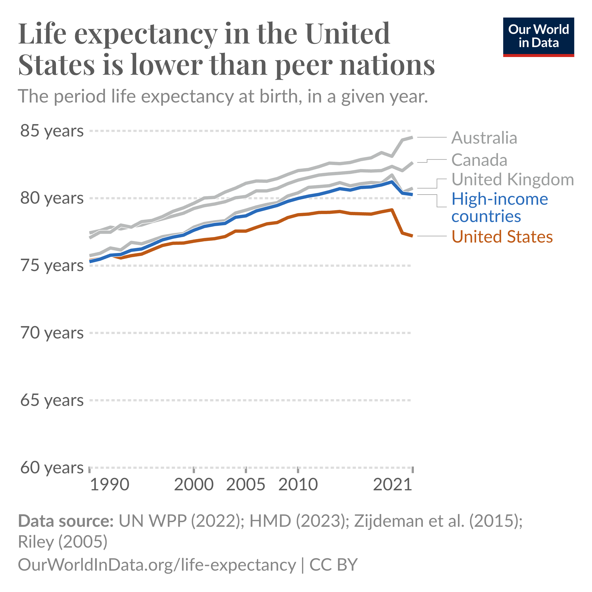

# Introduction {#sec-introduction}

```{r}
#| echo: false
#| output: false
#| message: false
#| warning: false

library(modelsummary)
library(tidyverse)

```

```{=html}

<style>
.problem {
    background-color: #f8f9fa;
    border: 1px solid #dee2e6;
    border-radius: 8px;
    padding: 20px;
    margin: 20px 0;
}
.context {
    background-color: #e8f4f8;
    padding: 12px;
    border-radius: 5px;
    margin-bottom: 15px;
    border-left: 4px solid #2874a6;
}
.question {
    margin: 15px 0;
    padding: 10px;
    background-color: #fff3cd;
    border-radius: 5px;
}
.answer-row {
    display: flex;
    align-items: center;
    margin: 10px 0;
    flex-wrap: wrap;
    gap: 10px;
}
.answer-row label {
    min-width: 320px;
    font-weight: 500;
}
select {
    padding: 8px 12px;
    font-size: 14px;
    border: 2px solid #ccc;
    border-radius: 5px;
    min-width: 300px;
    cursor: pointer;
}
select:focus {
    border-color: #2874a6;
    outline: none;
}
.correct {
    border-color: #28a745 !important;
    background-color: #d4edda !important;
}
.incorrect {
    border-color: #dc3545 !important;
    background-color: #f8d7da !important;
}
.explanation {
    margin-top: 10px;
    padding: 15px;
    background-color: #e7f3ff;
    border-radius: 5px;
    border-left: 4px solid #2874a6;
}
.note {
    font-size: 0.85em;
    color: #666;
    font-style: italic;
}
</style>

<script>
function checkAnswer(selectElement, correctValue) {
    if (selectElement.value === '') {
        selectElement.classList.remove('correct', 'incorrect');
    } else if (selectElement.value === correctValue) {
        selectElement.classList.remove('incorrect');
        selectElement.classList.add('correct');
    } else {
        selectElement.classList.remove('correct');
        selectElement.classList.add('incorrect');
    }
}
</script>

```


::: {.callout-tip collapse="true"}
## **Key Questions**
- What is the difference between correlation and causation?
- What does an econometrics research project entail?
- What are the main types of data formats we will work with?
- What is statistical software and why is it useful?
:::

::: {.callout-note collapse="true"}
## **Suggested Readings**
- @wooldridge_introductory_2019, Ch. 1
- @wickham_r_2023, Ch. 1
:::

## What is this Class About?

This class is obviously dedicated to the study of econometrics (endearingly shortened `metrics).
But what exactly does econometrics entail?
What differentiates it from broader terms such as "statistical analysis" or "data analysis"?

From @wooldridge_introductory_2019, we get a classic definition of econometrics:

> "...statistical methods for estimating economic relationships, testing economic theories, and evaluating and implementing government and business policy."

However, my view of econometrics is at the same time, broader and more narrow:

::: {.callout-note}
## Definition of Econometrics
The practice of using statistical, quantitative methods to study social phenomena and provide insights into public policy.
More specifically,
modern econometrics has focused on identifying the **causal effects** of social phenomena/policy as opposed to **correlations**.
:::

In other words, I view the practice of econometrics as the use of quantitative methods to understand the social world around us,
with a special (though not exclusive) lens focusing on separating correlation from causation.

## Does Having Health Insurance *Cause* You to be Healthier?

Let's think about a critical question in public policy: *does having health insurance make someone healthier*?
This is especially an important question in the context of the United States,
which does not have a public health insurance system.
Instead, it is a predominantly private system entangled with a complex net of social safety nets meant to provide a patchwork of coverage to the most marginalized.

However, as of 2023, 9.5% of U.S. adults do not have any health insurance coverage.^[Source: [KFF](https://www.kff.org/uninsured/key-facts-about-the-uninsured-population/)]
Would the US as a whole be better off guarantee health insurance coverage for everyone?
If health insurance makes people healthier,
then there may be a strong case to do so.
If not, the benefits of such a system would become, at the very least, more opaque.


Let's take a look at life expectancy in the US (a course but important measure of population health),
relative to similar high-income, developed countries.
@fig-us-life-exp-vs-peers shows the average life expectancy from 1990 to 2021
for the US, UK, Canada, Australia, and a number of other high-income countries.
As can be seen, the US performs considerably worse in terms of life expectancy,
and this divergence between peer countries has gotten *larger* since the 1990s,
and especially during the COVID-19 pandemic.

:::{#fig-us-life-exp-vs-peers}



Source: [Our World in Data](https://ourworldindata.org/data-insights/life-expectancy-is-lower-in-the-united-states-than-in-other-high-income-countries)

Life expectancy in the US vs. peer countries.

:::

Critically---with the exception of the US---all of the countries in the peer group have some form of universal health care.
In other words, all developed countries which are healthier than the US have policies which guarantee the uninsured rate is zero.

This then leads to a critical question: 
did universal health insurance *cause* these countries to have better health outcomes?
Or is this a correlation between policy and outcomes?
Certainly, 
one could make an argument that having health insurance does cause better health outcomes.
On the other hand,
there are lots of differences between the US and other high-income countries which may also explain the pattern seen in @fig-us-life-exp-vs-peers.
For example,
maybe these countries have different regulations regarding the food quality, which may explain part of the difference in life expectancy.
Or maybe because relatively more people commute to work via bicycle or walking,
which may have health benefits compared to driving to work.

These other differences between groups which may *confound* our comparison between countries with universal health insurance and those without
also extends to individuals.
In the US at least,
those with health insurance may be more likely to have a high-paying job which includes insurance as a benefit.
Therefore, a comparison between those who have insurance and those who do not will be plagued with the fact that those
who have insurance *also are more likely to have a high income job*, who may have had better health outcomes regardless of if they had insurance or not.
In other words,
we may be confusing *correlation* for **causation*.


::: {.callout-note}
## Correlation vs. Causation
The **correlation** between two variables describes how they move together. It means two things are *associated*.
**Causation** describes a direct relationship where a change in one variable causes a change in another. It means one thing *makes the other happen.*
:::

A key part of the content in this course is to think about when our comparisons are describing a **correlative** relationship or a **causal** relationship.
We will study techniques which---if one is convinced that the requisite assumptions hold---will actually be able to recover the *causal effect* of social phenomena,
and bring important insights into essential public policy questions like:
what is the effect of health insurance on health outcomes?
Does going to college cause you to have higher wages?
Do immigrants reduce native wages?
and does policing cause decreases in crime?

## Broad Steps of Econometric Analysis

Let’s say we want to know what the effect of on-the-job training has on your wage.
What steps would we need to take to answer this question?

### Step 1: Write the Model

Our first step would be to write an *econometric model,*
with the goal of using data and econometric tools to *estimate the parameters of the model.*
This model can sometimes be derived from a formal model in economics (i.e., the profit maximization of firms),
but it is at least based on some intuitive logic which mathematically relates some variable (the **dependent variable**)
to some **independent variable**(s).

An example of the type of econometric model you may want to run to study the effect of on-the-job training is:

$$
wage = \beta_0 + \beta_1(training) + \mu,
$$ {#eq-basic-econometric-model}

where $wage$ is the *outcome, left-hand side (LHS), predicted, or dependent variable* (these are synonyms for the same thing),
and $training$ is the *explanatory, right-hand side (RHS), predictor, or independent variable* (again, synonyms for the same thing).
The $\beta_0$ and $\beta_1$ variables are the parameters that we want to *estimate the value of* using econometric methods,
and they tell us *how* our *independent* variable is related mathematically to our dependent variable.

### Step 2: Find and Explore the Data

The next thing you have to do---after we figure out the model we want to estimate, such as in @eq-basic-econometric-model---is to get the data.
There is a *huge* range of datasets out there,
and we are especially lucky that the data-gathering infrastructure in the United States is incredibly robust.
As we go through the semester, we will work with as many different datasets that we can,
which cover a range of topics: from sports to health, crime, and economic development.
While different datasets usually can their own quirks,
broadly speaking there are three different types of data we will work with in this class:

1. **Cross-sectional data:** This is data which contains information on units (e.g., individuals, countries, firms, households, etc.) at a *single point in time.*
This data is the most common,
and also is generally the simplest to work with,
so we will start out by working mostly with cross-sectional data.

2. **Time-series data:** This data consists of observations on a single unit (e.g., a country's Gross Domestic Product (GDP), a specific company's stock price, or the national unemployment rate) across multiple time periods (e.g., years, quarters, months, or even minutes).
In time series data,
a crucial characteristic is the temporal ordering of the observations. 
This structure is often used for forecasting and modeling how a variable's past values influence its present and future values.

3. **Panel (or Longitudinal) data**: Panel data combines both cross-sectional and time-series dimensions. 
It consists of observations on multiple units (e.g., individuals, firms, or countries) over multiple time periods.
It essentially tracks the same set of cross-sectional units over time. 
This gives it more information, more variability, and allows researchers to use a rich set of methods
to really hone in on the causal effects of whatever social phenomena being studied.

In all of these cases,
econometric data is organized in what is called a **matrix** or a **dataframe**.
It should look roughly similar to an Excel Spreadsheet,
where each column represents a different variable (which is usually labelled, sometimes not),
and each row represents the values that a specific unit has across these variables.

For example,
the data we use to estimate the model in @eq-basic-econometric-model may look like @tbl-training-wages,

```{r}
#| echo: false
#| message: false
#| warning: false
#| label: tbl-training-wages
#| tbl-cap: "Relationship between training and wages for 10 workers"

person_name <- c("Paul", "Ringo", "George", "John", "Linda", 
                 "Yoko", "Pattie", "Maureen", "Cynthia", "Barbara")
person <- c(1, 2, 3, 4, 5, 6, 7, 8, 9, 10)
wage <- c(18.50, 22.00, 17.65, 27.95, 19.20, 
          24.80, 20.50, 23.75, 16.40, 28.50)
training <- c(1, 3, 2.5, 8.2, 0.5, 
              6.8, 5.5, 4.2, 0.8, 9.1)

data <- tibble(
    person_name = person_name,
    person_id = as.character(person),
    wage = wage, 
    yrs_training = training)

datasummary_df(data)

```

where the **person_name** column is (obviously) each person's name,
**person_id** column corresponds the unique numerical identifier associated with each person 
(this will be more common to see in datasets since names are usually anonymous),
the **wage** column shows each person's hourly wage in dollars,
and the **yrs_training** column shows the number of years each
person received on-the-job training.
This row-column structure of organizing data is so fundamental that the word *column* is often interchanged with the word *variable*.

When you first look at some data,
it is really important to figure out what each row represents.
In the simple example shown in @tbl-training-wages,
this is straightforward since each row represents a different person.
However,
in more complex datasets,
it may not be immediately obvious what each row represents.
For example,
in panel data,
each row may represent a specific person at a specific point in time.
So row 1 may be Paul in year 2020,
row 2 may be Paul in year 2021,
row 3 may be Ringo in year 2020,
and so on.
Figuring out what each row represents is *critical* to understanding the data,
as well as how to appropriately analyze it.

Once we have the data in hand,
then we may need to do some data cleaning and organization.
This may involve:
- Removing missing values
- Creating new variables
- Changing the format of variables (e.g., from string to numeric)
- Merging datasets together
- Filtering the data to only include certain observations
- And many other tasks.

These are all tasks that in many cases take up the bulk of the time in an econometric research project,
and while not the most glamorous part of econometrics,
it is absolutely essential to get right.

Before moving on to estimation,
it is also important to do some **exploratory data analysis**,
(which should be considered step 2.5 in the econometric research process).
This involves looking at summary statistics of the data (means, medians, standard deviations, etc.),
as well as visualizations (histograms, scatter plots, etc.).
Exploratory data analysis is important for understanding the data,
as well as for identifying potential issues with the data (e.g., outliers, missing values, etc.).

One of the most important parts of exploratory data analysis is to look at the relationship between the dependent variable and independent variable(s) in your model.
One way this can be done is using a **scatterplot**,
which plots each observation in the dataset using the independent and dependent variables as coordinates,
with the independent variable on the x-axis and the dependent variable on the y-axis.

```{r}
#| echo: false
#| message: false
#| warning: false
#| label: fig-scatter-training-wages
#| fig-cap: "Relationship between training and wages for 10 workers"

p1 <- ggplot(data, aes(x = yrs_training, y = wage)) +
  geom_point(size = 3, color = "blue") +
  labs(
    title = "Scatterplot of Wage vs. Years of Training",
    x = "Years of Training",
    y = "Wage ($ per hour)"
  ) +
  theme_minimal()

print(p1)

```

In @fig-scatter-training-wages,
we see a scatterplot of the relationship between years of training and wages for the 10 workers shown in @tbl-training-wages.
From this plot,
we can see that there is a positive relationship between years of training and wages:
as years of training increases,
wages also tend to increase.
While not good enough to draw any strong conclusions,
one can see how this type of exploratory data analysis is useful for understanding the data and the relationship between variables.

### Step 3: Estimate the Model

Once we have a model in mind as well as the appropriate data,
we can then use our econometric methods to estimate the relationship.
The bulk of this class is dedicated to this step in the econometric research process,
but the other stages are no less important!
The most common way that econometric models are estimated is with **Ordinary Least Squares** (OLS),
which you may remember from your pre-req.
In addition to estimating the actually value of the parameters in the model,
we also want some idea of how *uncertain* we are about the estimated parameter value.
This is where notions of statistical significance and confidence intervals come in.


### Step 4: Interpret the Estimate

Once we have an estimated number for the parameter in our model,
we then have to interpret the number.
Here,
the phrase "interpret the estimate" means two parallel things.
First, there is the literal, mathematical interpretation of the model.
This will change depending on the functional form we use to estimate the model,
and we will spend lots of time learning about this.
The second part of "interpreting" the model is about what the results mean in the context of your broader research question.
Is your estimate big or small?
Is it economically important?
Do you actually think it reflects a causal effect?
These are all types of interpretation which are a critical part of econometrics research,
but for which there is not usually a formula we can use.
A large part of the "art" working on an econometrics project is exactly this type of interpretation,
and how you form it into a compelling narrative.
While there are some tools we will cover which will help in this regard,
in my opinion,
nothing will help you more with this than just reading lots of good, well-written econometrics papers.

## Statistical Software

Much of the econometric process is done using specialized statistical software.
We will use this software to: 
"clean" our data and organize in the appropriate row-column format to do our econometric estimations;
explore our data using descriptive statistics (means, medians, etc.) and visualizations (an increasingly important part of a compelling econometric project);
estimate our model and conduct analyses of statistical uncertainty;
and output our results to easy-to-interpret tables and figures.

There are a few commonly used econometrics software:

- **Stata:** Proprietary software purpose-built for econometrics
- **R:** Open-source programming language with a focus on statistical analysis
- **Python:** Open-source programming language with a focus on data science more broadly
- **EViews:** Proprietary software with a focus on forecasting and other time series applications

Each one of these software of their own pros and cons,
and it is worth knowing several quite well.
For the purposes of this class,
we will learn the **R** programming language to do econometrics.
If you haven't take the time to review @sec-installingR to learn more about R,
how to install it,
and to run your first chunk of code!

## Summary and Conclusion

This chapter introduced the fundamental framework that will guide our study of econometrics throughout this course. 
We defined econometrics as the use of quantitative methods to understand social phenomena and inform public policy, with a particular focus on distinguishing between correlation and causation.
Through the example of health insurance and health outcomes, 
we saw how patterns in data can be misleading. 
While the United States lags behind peer countries in life expectancy, and those peer countries all have universal health insurance, we cannot immediately conclude that universal coverage causes better health outcomes. 
The tools you will learn in this course are designed to help you identify causal relationships rather than mere associations.

### Key Takeaways:

- **Econometrics vs. correlation:** Modern econometrics focuses on identifying causal effects, not just correlations between variables

- **Four steps of econometric research:**
    1. Write an econometric model
    2. Find and explore the appropriate data
    3. Estimate the model parameters
    4. Interpret the results

- **Three main data types:** Cross-sectional (single point in time), time-series (one unit over time), and panel data (multiple units over time)

- **Statistical software:** We will use **R** to clean data, estimate models, and present results

As we move forward, remember that econometrics is as much an art as it is a science. 
The mathematical tools we will learn are powerful, 
but they are only as good as the questions we ask
and the care with which we interpret our results.

## Check Your Understanding

:::: {.content-visible when-format="html"}

For each question below, 
select the best answer from the dropdown menu. 
The dropdown will turn green if correct and red if incorrect. 
Click the “Show Explanation” toggle to see a full explanation of the answer after attempting each question.

```{=html}
<div class="question">
<div class="answer-row">
    <label>i. You observe that cities with more police officers tend to have higher crime rates. A friend concludes that "police cause crime." What is the most likely issue with this interpretation? </label>
    <select onchange="checkAnswer(this, 'b')">
        <option value="">-- Select Answer --</option>
        <option value="a">This is correct—more police leads to more crime</option>
        <option value="b">This is a correlation that may reflect confounding factors</option>
        <option value="c">The data must be incorrect</option>
        <option value="d">Police and crime are unrelated</option>
    </select>
</div>

<div class="answer-row">
    <label>ii. A researcher collects GDP data for France from 1990 to 2023. What type of data is this? </label>
    <select onchange="checkAnswer(this, 'b')">
        <option value="">-- Select Answer --</option>
        <option value="a">Cross-sectional data</option>
        <option value="b">Time-series data</option>
        <option value="c">Panel data</option>
        <option value="d">Experimental data</option>
    </select>
</div>

<div class="answer-row">
    <label>iii. In the model: \(wage = \beta_0 + \beta_1(training) + \mu\), which statement is correct? </label>
    <select onchange="checkAnswer(this, 'c')">
        <option value="">-- Select Answer --</option>
        <option value="a">Wage is the independent variable and training is the dependent variable</option>
        <option value="b">Training is the dependent variable and wage is the independent variable</option>
        <option value="c">Wage is the dependent variable and training is the independent variable</option>
        <option value="d">Both wage and training are independent variables</option>
    </select>
</div>

<div class="answer-row">
    <label>iv. After writing your econometric model but before estimating it, what should you do? </label>
    <select onchange="checkAnswer(this, 'b')">
        <option value="">-- Select Answer --</option>
        <option value="a">Interpret the results</option>
        <option value="b">Find and explore the data</option>
        <option value="c">Submit for publication</option>
        <option value="d">Choose your statistical software</option>
    </select>
</div>

<div class="answer-row">
    <label>v. <strong>(Challenge)</strong> Researchers find that people with health insurance have better health outcomes than those without. They want to claim that health insurance <em>causes</em> better health. What is the most serious threat to this causal interpretation? </label>
    <select onchange="checkAnswer(this, 'b')">
        <option value="">-- Select Answer --</option>
        <option value="a">The sample size is too small</option>
        <option value="b">People with insurance may differ in other ways (e.g., income, education) that also affect health</option>
        <option value="c">Health outcomes are hard to measure</option>
        <option value="d">Some people don't like going to the doctor</option>
    </select>
</div>
</div>

```

::: {.callout-tip collapse="true"}
## Show Explanation

i. Cities may hire more police *because* they have high crime (reverse causality), or other factors like population density may drive both police presence and crime rates. This illustrates why correlation does not imply causation.

ii. This tracks a single unit (France) across multiple time periods (1990–2023), which defines time-series data. Cross-sectional data would be multiple countries at one point in time; panel data would be multiple countries over multiple years.

iii. The dependent variable (wage) is what we're trying to explain—it goes on the left-hand side. The independent variable (training) is what we think affects it—it goes on the right-hand side.

iv. The four steps of econometric research are: (1) write the model, (2) find and explore data, (3) estimate the model, (4) interpret results. Exploratory data analysis—looking at summary statistics and visualizations—is critical before estimation.

v. Those with insurance often have higher incomes, more education, and better access to other resources—factors that independently improve health. Without accounting for these confounders, we cannot separate the effect of insurance from the effect of these other characteristics. This is exactly why econometric methods for causal inference exist.

:::

:::::

::::: {.content-hidden when-format="html"}

*Note: This section contains interactive content only available in the HTML version.*

:::::