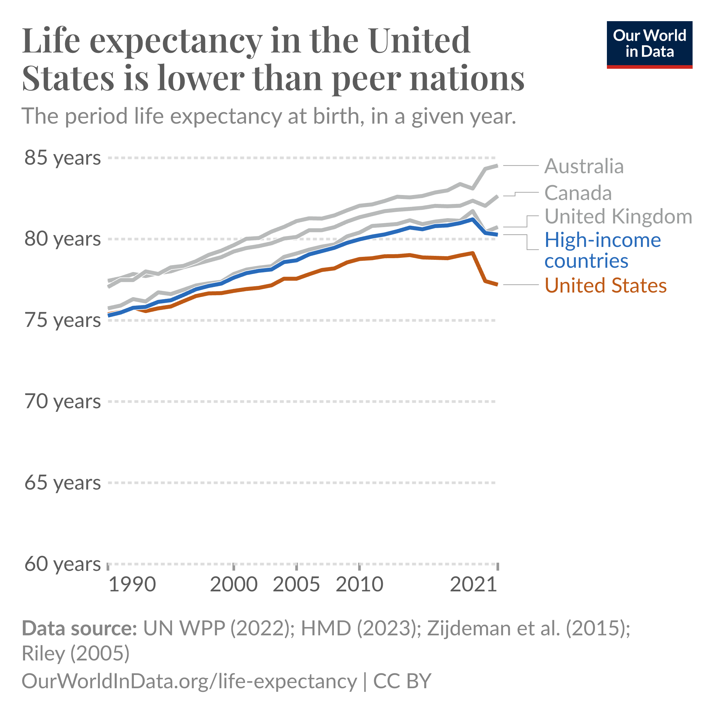
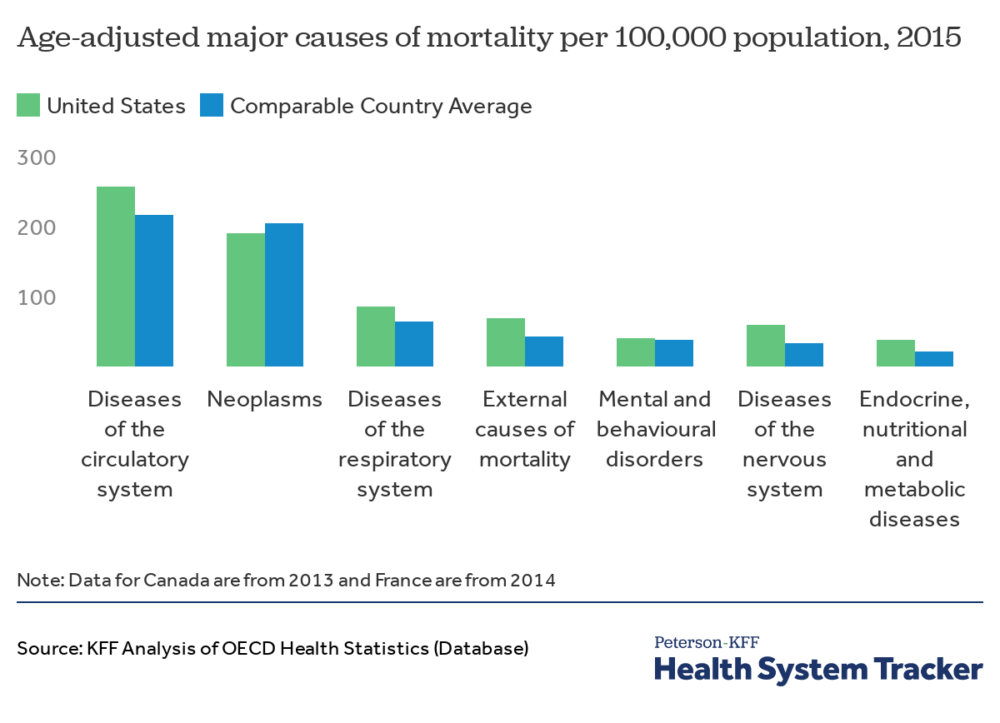
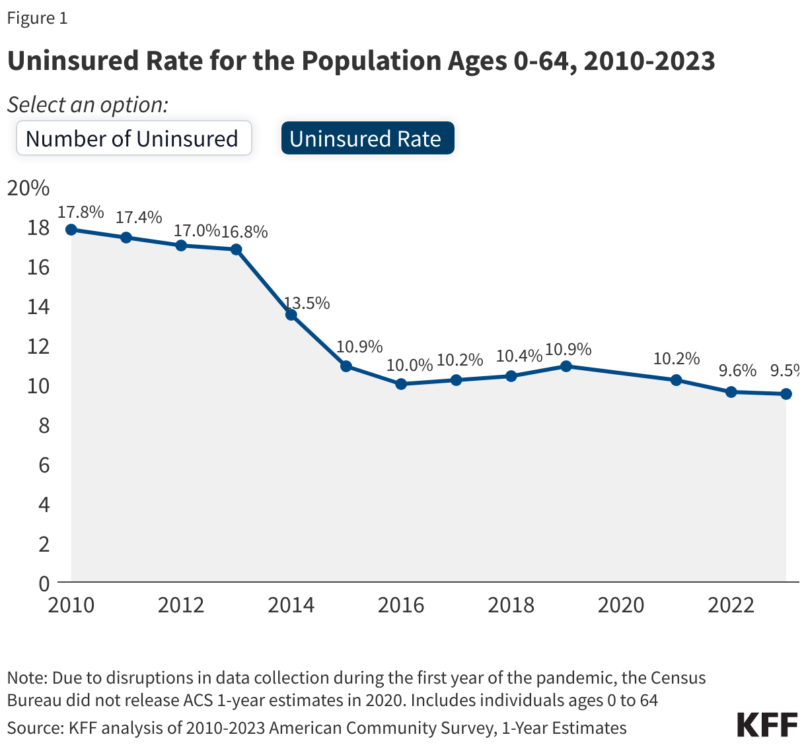

```{r}
#| label: setup

library(tidyverse)
```

## About Me: Prof. Ray Caraher

I am a recent PhD from UMass Amherst. My research focuses on the relationship between public/economic policy and maternal, infant, and child health and racial/ethnic health disparities.

This is my first year at Colby!

- Email: [rcaraher@colby.edu](mailto:rcaraher@colby.edu). I will do my best to respond within 24 hours on weekdays.
- Office: 365 Diamond Bldg.
- Office Hours: Tuesdays, 2pm - 4pm, Thursdays, 1pm - 3pm, Fridays, 10:30am - 12:30pm. Or by appointment.

# What is Econometrics?

## What is this Class About?

**Econometrics:** "...statistical methods for estimating economic relationships, testing economic theories, and evaluating and implementing government and business policy."

## What is this Class About?

Or, in my opinion,

**Econometrics:** The practice of using statistical, quantitative methods to study social phenomena and provide insights into public policy

Modern econometrics has really focused on identifying the **causal effects** of social phenomena/policy as opposed to **correlations**


## The US is Unhealthy Relative to Peer Countries

{fig-align="center" width="150%"}

## The US is Unhealthy Relative to Peer Countries

{fig-align="center" width="90%"}

## One potential reason: health insurance

{fig-align="center" width="90%"}

## Does having health insurance cause you to be healthier?

Discuss with a classmate

## Does having health insurance make you healthier?

::: {.incremental}
- Health insurance coverage is **correlated** with better health outcomes
- But does that mean health insurance **causes** better health?
:::

## Does having health insurance make you healthier?

- Health insurance coverage is **correlated** with better health outcomes
- But does that mean health insurance **causes** better health?

**Econometrics** can help us answer this question!

## Other examples of causal inference questions

::: {.incremental}
- Do tariffs increase domestic production?
- Does a college degree increase your earnings?
- Is immigration bad for native workers?
- Do police reduce crime?
:::

## What Is the Broad Process for Econometric Analysis?

Let's say we want to know what the effect of on-the-job training has on your wage.

What **steps** would we need to take to answer this question?

## What Is the Broad Process for Econometric Analysis?

Step 1: Write an *econometric model*

::: {.incremental}
- Sometimes formally derived from an *actual economic model* (e.g., profit maximization of the firm)
- Always based on some **intuition** which **mathematically relates** some *variable(s)* to some other *variables(s)*
:::

## What Is the Broad Process for Econometric Analysis?

One example of an econometric model would be (we will learn what this equation means later!):

$$ wage = \beta_{0} + \beta_{1} educ + \beta_{2} exper + \beta_{3} training + \epsilon $$

## What Is the Broad Process for Econometric Analysis?

Step 2: Find and explore the data (easier said then done!)

Many different types of data:

::: {.incremental}
- cross-sectional (most common): a sample of individuals, households, firms, countries, or any other unit observed at a given point in time
- Data for econometric is organized (or needs to be organized) as a **matrix** or **dataframe**
:::


```{r}
#| label: create-test-data

test_data <- tibble("person" = c(1, 2, 3, 4),
                    "wage" = c(17.25, 11.90, 23.20, 18.45),
                    "educ" = c(12, 16, 16, 10),
                    "exper" = c(10, 1, 2, 15),
                    "training" = c(2, 0, 1, 3))

set.seed(81264)
test_data_2 <- tibble("educ" = rnorm(50, mean = 10, sd = 2),
                      "err" = rnorm(50),
                      "wage" = log(educ * 1.15 + err))
```

## What Is the Broad Process for Econometric Analysis?

```{r}
#| label: show-data

print(test_data)
```

## What Is the Broad Process for Econometric Analysis?

- Are we missing a lot of values for our data? 
- Are there outliers, obvious data-entry errors, or other oddities we need to deal with?
- What are some summary statistics (mean, standard deviation, etc.) for our variables?
- How do certain variables of interest move together (or not)?

## What Is the Broad Process for Econometric Analysis?

Step 3: *Estimate* the relationship

::: {.incremental}
- Here we use statistical techniques to **estimate** our **econometric model** using our **data**
- Many ways to do this, but by far most common is **Ordinary Least Squares (OLS)**
- Also estimate the **uncertainty** of our estimate to test *statistical significance*
:::

## What Is the Broad Process for Econometric Analysis?

::: {.smaller}
```{r}
#| label: regression-output

reg1 <- lm(wage ~ educ, data = test_data_2)
summary(reg1)
```
:::

## What Is the Broad Process for Econometric Analysis?

Step 4: *Interpret* the estimates

What does our estimate mean?

::: {.incremental}
- There is a literal, *mathematical interpretation*
- In our made-up estimate above, each additional year of education suggests an increase in wages of 10%
- But what does this really mean? Is it big or small? Is it economically important?
:::


## What Is the Broad Process for Econometric Analysis?

Step 4: *Interpret* the estimates

What does our estimate mean?

- There is a literal, *mathematical interpretation*
- In our made-up estimate above, each additional year of education suggests an increase in wages of about 12%
- But what does this really mean? Is it big or small? Is it economically important?

In this course, we will learn how to do **all four** of these steps!


# Econometrics with Statistical Software

## Statistical Software {.smaller}

Much of the econometric process is done using specialized **statistical software**.

We use this software to:

1. "Clean" our data and organize it so we can do econometric analysis
2. Use our data to explore our questions using descriptive statistics and data visualizations
3. Estimate our models and calculate the statistical uncertainty
4. Output our results as tables and figures so we can write/present them

## Examples of Statistical Software

::: {.incremental}
- **Stata:** Proprietary software purpose-built for econometrics
- **R:** Open-source source programming language with a focus on statistical analysis
- **Python:** Open-source source programming language with a focus on data-science more broadly
- **EViews:** Proprietary software with a focus on time series
:::


## R and R Studio {.smaller}

In this class, we will focus our learning on the **R** programming language

Why R?

- **Open-source:** Free to use, with a large community which have built (literally) thousands of packages to extend the capabilities of R
- **Object-Orientated:** Can store multiple "objects" in its memory, giving it far more flexibility in cleaning, organizing, and compiling data
- **Not Just Econometrics:** Specialized uses of R in dozens of fields, in academia and the private sector

. . .

**R Studio:** An integrated development environment (IDE) designed for working with the R programming language. It provides a user-friendly interface and a set of tools that make it easier to write, run, and manage R code and projects.

## R and R Studio

In this class, we will focus our learning on the **R** programming language


## R and R Studio

There are instructions on how to install this software in the appendix of the Lecture Notes. Review them and install R and R Studio as soon as you can!

# Learning Econometrics in EC 325

## What We Will Learn in This Class {.smaller}

::: {.incremental}
- The "Gold Standard" of Causality: Randomized Control Trials
- Econometric Swiss Army Knife: Ordinary Least Squares (OLS)
- Controlling for Confounders: Multivariate OLS
- How Uncertain is Our Estimate? Statistical Inference Tools
- The Non-Linear World: Dummies, Interactions, and Polynomials
- Panel Data and Fixed Effects: On the Road to Causal Inference
- The Causal VIP: Difference-in-Differences
- Alternative ways of causal methods: instrumental variables
- Time Series Methods
:::

## TA Info

TA:

- Amrit Shakya (ashaky26@colby.edu)

TA Help Hours:

- TBD

## Required Materials

- Reliable access to a computer (talk to me if this is a concern!)

- A [Github](https://github.com/) account to access the course materials
  - A free account is fine, but you get access to the "Pro" level for free if you use your @colby email address and send them your ID!

## Git and GitHub

I use **Git** and **GitHub** to host all course content (except assignments, which are on Moodle)

- Includes lecture notes, slides, data, in-class labs, etc.
- **Git:** A version control system that tracks changes to files over time
- **GitHub:** A website that hosts Git repositories and makes them easy to share

## Git and GitHub

Why use Git/GitHub?

- Industry standard for collaborative coding and version control
- You can see exactly what changed between versions
- Useful skill for research and industry jobs

## Lecture Notes

- You are required the read the lecture notes for this course *before we cover the unit in class*

- The notes are available either in the Github Repo or at: [https://www.raymondcaraher.com/ec325/](https://www.raymondcaraher.com/ec325/)

- Lecture notes include optional multiple choice review questions

## Optional Texts {.smaller}

- These textbooks are easy to find are this course content is heavily inspired by them:

- **Introductory Econometrics: A Modern Approach by Jeffrey M. Wooldridge (2019)**. 
The 7th edition is the most recent, but any edition 5 or above will work. We will
primarily use this text for part of the course more reliant on statistical theory.

- **Real Econometrics by Michael Bailey (2020)**. 
This is a good, more “applied” version of the Wooldridge textbook.

-  **Mastering 'Metrics by Joshua D. Angrist and Jörn-Steffen Pischke (2015).**
This text is an excellent companion to the other texts, but is not like a traditional
textbook.


## Pre-Reqs

- Intermediate Micro
- Research Methods and Statistics

If you don't have either one of these, let me know!

## Assignments

Your grade will be determined by:

. . .

| Assessment | Weight |
|------------|--------|
| Concept Checks | 10% |
| Problem Sets | 30% |
| Midterm Exam | 10% |
| Final Exam | 15% |
| Final Project | 30% |
| Engaged Learning | 5% |

## Concept Checks

- Short, weekly coding assignments testing your understanding of the readings and lectures
- Due each Friday at 11:59pm (with some exceptions)
- Graded on a 3-point scale (0 = no attempt, 3 = excellent)
- Lowest 2 grades dropped at end of semester

**No collaboration allowed** on concept checks. Come to office hours/email if you have questions!

## Problem Sets

- **4** problem sets during the semester
- Designed to have you **replicate results from major published economics papers**
- A considerable portion of your grade — treat each as a mini-project
- No late problem sets allowed

You can (*and are encouraged!*) to work in groups on problem sets.

## AI Policy

AI tools can be useful for coding questions, but over-reliance can become a crutch. The AI policy for this course is:

- You are allowed to use AI tools on your **problem sets and final project** for **specific, coding-related questions only**
- **No AI tools allowed on Concept Checks**
- Any use of an AI tool must be **attributed** in your submission
- You **must understand** the code you submit

If you choose to use AI, Colby recommends **Google Gemini** with your Colby account.

## Exams

- Midterm exam (in-class, Thursday, March 12)
- Final exam (per registrar schedule)
- Both are in-person; one double-sided note sheet allowed
- Focus on concepts and interpretation — no software, but you will analyze output

## Engaged Learning

Active learning is **necessary** to learn econometrics and counts as part of your grade.

What counts:

- Coming to class and answering/asking questions
- Going to office hours and TA help hours
- Coordinating among group members
- Helping classmates with the course material

## Attendance

- All classes are **in-person** (unless otherwise noted, maybe due to weather) and attendance is **required**
- Please **do not come to class** if you are feeling unwell
- No formal doctor's note required, but please email me to check-in
- Unexcused absences will count against your engaged learning grade

## Final Project

A research project completed in **groups of 3-4 students**. I will form groups based on your shared subfield interests, then groups will narrow down on a specific research question.

This project will be a **considerable amount of work**! We will have check-ins throughout the semester to make sure things are going smoothly.

## Final Project (cont.)

You will have to turn in:

1. A project proposal (week 5)
2. A data summary (week 8)
3. A preliminary findings report (week 10)
4. A final presentation (last week of class)
5. A final written report (last day of finals)
6. A peer review evaluating your and your group members' contributions (last day of finals)

## About you!

1. Name
2. Pronoun
3. Year
4. What you did over Jan Plan

## For Next Time

- Concept Check 1 (due tomorrow!)
- Fill out the survey so I can assign groups!
- Read **unit 1 and unit 2** of the lecture notes
