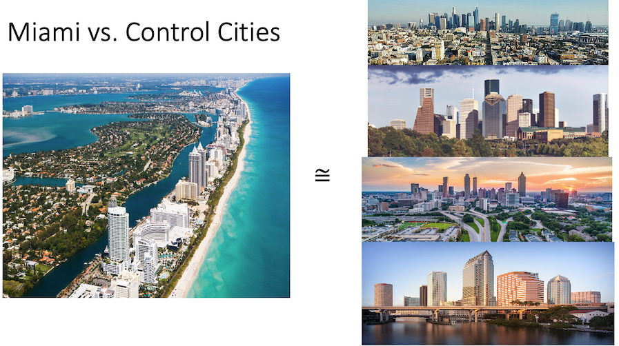
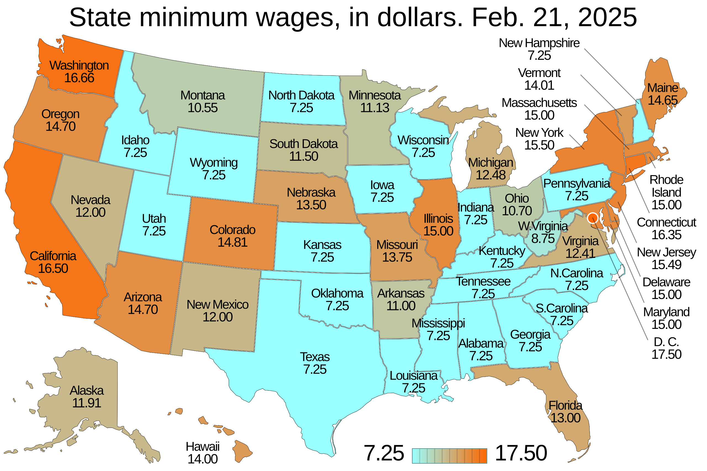
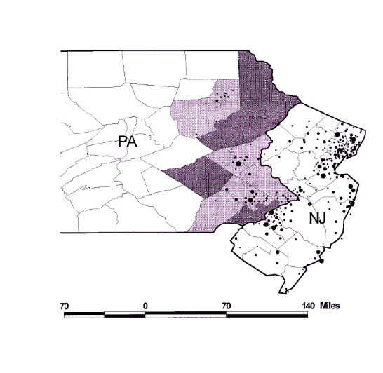

```{r}
#| label: setup

library(tidyverse)
library(fixest)
library(modelsummary)
library(patchwork)

options(scipen = 999)

theme_set(theme_minimal(base_size = 16) +
          theme(plot.title = element_text(face = "bold", size = 18),
                plot.subtitle = element_text(size = 13, color = "gray40"),
                panel.grid.minor = element_blank()))
```


## Econometrics So Far

- Started with the "gold standard" of causal inference: **RCTs**
- Next best alternative: **multivariate OLS**
- Even better: **Panel data with fixed-effects**
- Now: Using control **units** instead of control **variables**


## Multivariate OLS and its Discontents {.smaller}

- Often, even when we include control variables, we still have OVB
  - Example: Unobserved ability, geography, etc.
- In many of those cases, *if we have panel data* we can use **fixed-effects** to control for either:
  - Unit-specific, time-invariant factors
  - Unit-common, time-variant shocks
- But what if that *still isn't good enough?*
  - e.g., unit-specific, time-variant factors can't be accounted for!
- Instead of relying purely on **control variables**, a (perhaps better) choice is to use **control units**


## "As Good As" Random Selection {.smaller}

- We saw how an RCT *eliminates the selection bias term*
  - The random assignment of units to the *treated* vs. *control* groups ensured there was no systemic differences between groups
- However, the whole point of this semester on regression is that often RCTs are often not possible
- But what if we could find control units such that units were **as good as randomly assigned** into treatment and control groups
- This would also eliminate the selection bias term!


## Randomized vs. Natural Experiments {.smaller}

- When we want to eliminate the selection bias term, but cannot use an RCT, we can instead leverage **natural experiments**

. . .

::: {.callout-note}
## Natural Experiments
A **Natural Experiment** is a study based on observational data where the "treatment" is assigned by forces outside the researcher's control, such as **nature**, **policy changes**, or **other events**. Natural experiments create the conditions which *resemble random assignment*.
:::

. . .

- If a natural experiment (as good as) randomly assigns units into either a "treated" or "control" group, then this could also ensure our comparison between these groups is not plagued by selection bias


## Example: The Effect of Immigration on Native Wages {.smaller}

- Suppose you want to study the effect of immigration on wages across US cities
- A naive regression may look like the following:

. . .

$$
native\_wage = \beta_0 + \beta_1(immigrant\_share) + \mu
$$

. . .

- What are some of the issues with this regression?
  - OVB: immigrants probably move to cities which are **economically doing well**
- Even if we were to include **control variables** we may not be able to account for really important unobservable factors
  - E.g., what is the economic **trajectory** like in our cities?
- So what can we do since a regression won't give us a plausible causal estimate?


# The Mariel Boatlift

## The Mariel Boatlift

:::: {.columns}
::: {.column width="50%"}
{width=100% fig-align="left"}
:::
::: {.column width="50%"}
- In 1980, Cuba experienced a serious economic downturn
- Things got so bad that Castro allowed anyone who wanted to to leave the country
- Between April and October of 1980, **125,000** "Marielitos" left Cuba from **Mariel Harbor** and arrived in **Miami**
:::
::::


## The Mariel Boatlift as Natural Experiment

- This mass exodus of Cubans to the Miami had *nothing to do with labor market conditions*
- It was solely due to a) policy in Cuba, and b) the geographic proximity of Miami to Cuba
- In other words, the "treatment" of a large number of immigrants is **as good as randomly assigned** to Miami!


## Card (1990) Overview

:::: {.columns}
::: {.column width="50%"}
- David Card (1990) uses the boatlift as a **natural experiment** to study the effects of immigration on wages and employment
- Specifically, he compares labor market outcomes in 1979 (before the boatlift) to those 5 years later
:::
::: {.column width="50%"}
{width=100% fig-align="left"}
:::
::::


## Difference in Wages in Miami {.smaller}

- Card (1990) first finds the **difference** in (log) wages in Miami from **1979** (before the Boatlift) to the (average) of **1980 to 1985** (after the Boatlift)
- He focuses on *white, non-Hispanic* workers since they are most likely non-immigrants

. . .

| City | Pre (1979) | Post (1980-1985) | Diff (Post - Pre) |
|:----:|:----------:|:----------------:|:-----------------:|
| Miami| 1.85       | 1.83             | -0.02             |

. . .

- Can we think of this pre-post difference as a **causal effect** of immigration?
- **No!**
  - Employment conditions could have worsened not only in Miami, but everywhere else!
  - Only looking at changes in our *treated unit* may *mislead* us into thinking that those changes are **caused** by our treatment


## Control Cities

- We have to compare the changes in our **treated unit** to changes in **control units**
  - Otherwise, we may confuse the effects of a **broader trend** with our **specific treatment**
- Miami (Card argues) would have had the **same change in LM outcomes** as a set of control cities had it not experienced the Boatlift (i.e., was not "treated")
- Which cities do you think might be good "controls" for Miami?


## Control Cities and Counter-Factuals {.smaller}

- Card (1990) uses **Atlanta, Los Angeles, Houston, and Tampa-St. Petersburg** as the control cities
- He uses the average of LM outcomes in these cities as the **controls** for the "randomly treated" Miami
- In other words, he is assuming that Atlanta, Los Angeles, Houston, and Tampa-St. Petersburg form a good **counter-factual** group for Miami

. . .

::: {.callout-note}
## Counter-Factuals
A **counter-factual** is a "what if" scenario used to measure the causal impact of a policy, event, or decision. It works by comparing the actual outcome (what really happened) to a hypothetical outcome (what would have happened without the event). This hypothetical, "do-nothing" scenario is the counterfactual.
:::

---

{width=100% fig-align="center"}


## The Effect of Immigration on Native Wages

| City | Pre (1979) | Post (1980-1985) | Diff (Post - Pre) |
|:----:|:----------:|:----------------:|:-----------------:|
| Miami| 1.85       | 1.83             | -0.02             |
| Controls | 1.93   | 1.91             | -0.02              |


## The Effect of Immigration on Native Wages {.smaller}

| City | Pre (1979) | Post (1980-1985) | Diff (Post - Pre) |
|:----:|:----------:|:----------------:|:-----------------:|
| Miami| 1.85       | 1.83             | -0.02             |
| Controls | 1.93   | 1.91             | -0.02              |
|Treated - Control | | | **0.00** |

- The **causal effect** of immigration is thus the *change in outcome in our treated group* minus the *change in outcome of our control group*
- This difference between the pre-post changes between the two groups nets out any difference in employment that would have happened *had the treatment not occurred*
- This method of **double differencing** is called the **difference-in-differences**


## Levels vs. Trends

- Notice: Miami's wages are *lower* than the controls' in both periods
- DiD does **not** require equal levels across groups
- It only requires that the *changes* would have been the same absent treatment
- This is the **parallel trends assumption** --- more on this shortly


# DiD: The Formal Framework

## Estimating with Natural Experiments

- Card (1990) has **panel data** and can use it to recover the **causal effect of immigration**
- How? With a **Difference-in-Differences** (DiD) estimator


## Difference-in-Differences {.smaller}

- Assume we have *two groups*:
  - a **treated group** where $D_{i} = 1$ (i.e., Miami)
  - an **untreated group** where $D_{i} = 0$ (i.e., the other 4 cities)
- Also assume we have two *time periods*:
  - a **pre-treatment** period where $P_{t} = 0$ (i.e., 1979)
  - a **post-treatment** period where $P_{t} = 1$ (i.e., 1980-1985)


## Potential Outcomes, Revisited {.smaller}

- Recall our **Potential Outcomes Framework**
  - Every unit $Y_{it}$ has both a *treated outcome*, $Y_{it}(1)$
  - and a parallel universe with an *untreated outcome*, $Y_{it}(0)$
- Define the **average treatment effect on the treated (ATT)** of $X$ on $Y$ as:

. . .

$$
ATT = E[Y_{i,1}(1) | D_{i} = 1] -  E[Y_{i,1}(0) | D_{i} = 1]
$$

. . .

- In other words, the **ATT** is the (expected) difference between:
  - what *did* happen to the treatment group and,
  - what *would have happened* to them if they hadn't been treated (i.e., "parallel universe" Miami)


## Estimating the ATT {.smaller}

- Recall the **fundamental problem of causal inference** is that
  - we can never observe both potential outcomes at the same time

- We *can* observe $E[Y_{i,1}(1) | D_{i} = 1]$
  - This is simply the average outcome of the treated group in the post-period
- We *cannot* observe $E[Y_{i,1}(0) | D_{i} = 1]$
  - This is the *hypothetical outcome:* what would have happened to the treated group in the post-period if the treatment never existed?

- If we don't observe this second term, then how do we estimate the **ATT**?


## The Parallel Trends Assumption {.smaller}

- The **core assumption** of the difference-in-differences method

. . .

::: {.callout-note}
## Parallel Trends Assumption
The **Parallel Trends Assumption** states that, in the absence of treatment, the average outcome for the treated group would have followed the **same trend** as the average outcome for the control group:
$$
E[Y_{i1} - Y_{i0} | D_i = 1] = E[Y_{i1} - Y_{i0} | D_i = 0]
$$
:::

. . .

- **LHS:** the *unobservable* trend the treated group would have experienced without the treatment
- **RHS:** the *observable* trend of the control group


## The DiD Estimator

- Plugging the **parallel trends assumption** into the formula for the **ATT**, we get the **difference-in-differences estimator**:

. . .

$$
\underbrace{ATT}_{\text{treatment effect}} = \underbrace{(E[Y_{i1} | D_i = 1] - E[Y_{i0} | D_i = 1])}_{\text{trend for treated group}} - \underbrace{(E[Y_{i1} | D_i = 0] - E[Y_{i0} | D_i = 0])}_{\text{trend for control group}}
$$


## Visualizing the DiD Estimator

```{r}
#| fig-height: 5

did_data <- tibble(
  time = rep(c(1, 2, 3, 4), 2),
  group = rep(c("Control", "Treatment"), each = 4),
  outcome = c(10, 11, 12, 13,
              15, 16, 20, 21)
)

cf_line <- tibble(time = c(2, 3, 4), outcome = c(16, 17, 18))

ggplot(data = did_data, aes(x = time, y = outcome, color = group)) +
  geom_line(aes(group = group), linewidth = 1.2) +
  geom_point(size = 3) +
  geom_line(data = cf_line, aes(x = time, y = outcome),
            color = "#0072B2", linetype = "dashed", linewidth = 1.2) +
  geom_vline(xintercept = 2.5, linetype = "dotted", linewidth = 1) +
  annotate("text", x = 2.55, y = 22, label = "Treatment Starts", hjust = 0, size = 4.5) +
  annotate("text", x = 3.5, y = 18.75, label = "Counterfactual\n(Parallel Trend)",
           color = "#0072B2", hjust = 0.5, size = 4.5) +
  annotate("segment", x = 4, xend = 4, y = 18.2, yend = 20.8,
           arrow = arrow(type = "closed", length = unit(0.3, "cm"), ends = "both")) +
  annotate("text", x = 4.1, y = 19.5, label = "ATT", hjust = 0, size = 5.5, fontface = "bold") +
  labs(subtitle = "The ATT is the gap between the observed treatment outcome and the counterfactual",
       x = "Time Period", y = "Average Outcome", color = "Group") +
  scale_x_continuous(breaks = 1:4) +
  scale_color_manual(values = c("Control" = "grey50", "Treatment" = "#0072B2")) +
  theme(legend.position = "bottom")
```


# The DiD Regression

## The DiD Regression {.smaller}

- We usually use a regression to estimate the **ATT**
- The **DiD Regression** is estimated as:

. . .

$$
y_{it} = \beta_0 + \beta_1D_{i} + \beta_2P_{t} + \delta(D_{i} \times P_{t}) + \mu_{it}
$$

. . .

where:

- $D_i$ is the "treated group indicator", a dummy variable (1 if treated group, 0 if control)
- $P_t$ is the "post-period indicator", a dummy variable (1 if post-period, 0 if pre-period)
- $D_{i} \times P_{t}$ is the interaction term
- $\delta$ is the **treatment effect** (ATT)


## How the DiD Regression Works {.smaller}

- How does this regression work to estimate the ATT? Think about the *predicted outcome* $y_{it}$ for each of the 4 combos:

. . .

| Group ($D_i$) | Period ($P_t$) | Predicted Outcome ($\hat{y}_{it}$) |
|:-------------:|:--------------:|:------------------:|
| Control ($D_i = 0$) | Pre ($P_t = 0$) | $\beta_0$ |
| Control ($D_i = 0$) | Post ($P_t = 1$) | $\beta_0 + \beta_2$ |
| Treated ($D_i = 1$) | Pre ($P_t = 0$) | $\beta_0 + \beta_1$ |
| Treated ($D_i = 1$) | Post ($P_t = 1$) | $\beta_0 + \beta_1 + \beta_2 + \delta$ |

. . .

- Plugging in the predicted outcomes,
  - (Trend for treatment group) = (treated, post) - (treated, pre) = ($\beta_0 + \beta_1 + \beta_2 + \delta) - (\beta_0 + \beta_1) = \beta_2 + \delta$
  - (Trend for control group) = (control, post) - (control, pre) = ($\beta_0 + \beta_2$) - ($\beta_0$) = $\beta_2$
  - ATT = (Trend for treatment group) - (Trend for control group) = ($\beta_2 + \delta) - (\beta_2) = \delta$


## Anatomy of the DiD Regression

```{r}
#| fig-height: 5

reg_data <- tibble(
  group = factor(rep(c("Control", "Treated"), each = 2), levels = c("Control", "Treated")),
  x = c(1, 2, 1, 2), y = c(10, 12, 15, 20))

ggplot(reg_data, aes(x = x, y = y, color = group, group = group)) +
  geom_line(linewidth = 1.2) + geom_point(size = 4) +
  annotate("segment", x = 0.6, xend = 0.95, y = 10, yend = 10,
           linetype = "dotted", color = "grey50") +
  annotate("text", x = 0.5, y = 10, label = "\u03b2\u2080",
           size = 6, hjust = 1, color = "grey30") +
  annotate("segment", x = 0.85, xend = 0.85, y = 10.1, yend = 14.9,
           arrow = arrow(type = "closed", length = unit(0.15, "cm"), ends = "both"),
           color = "#7570b3") +
  annotate("text", x = 0.75, y = 12.5, label = "\u03b2\u2081",
           size = 6, hjust = 1, color = "#7570b3") +
  annotate("segment", x = 1.5, xend = 1.5, y = 10.1, yend = 11.9,
           arrow = arrow(type = "closed", length = unit(0.15, "cm"), ends = "both"),
           color = "#d95f02") +
  annotate("text", x = 1.4, y = 11, label = "\u03b2\u2082",
           size = 6, hjust = 1, color = "#d95f02") +
  annotate("segment", x = 2.15, xend = 2.15, y = 17.1, yend = 19.9,
           arrow = arrow(type = "closed", length = unit(0.15, "cm"), ends = "both"),
           color = "#e7298a") +
  annotate("text", x = 2.25, y = 18.5, label = "\u03b4 (ATT)",
           size = 6, hjust = 0, color = "#e7298a") +
  geom_point(aes(x = 2, y = 17), color = "#0072B2", shape = 1, size = 4, stroke = 1.5,
             inherit.aes = FALSE) +
  annotate("text", x = 2.25, y = 17, label = "Counterfactual",
           size = 4, hjust = 0, color = "#0072B2", fontface = "italic") +
  scale_x_continuous(breaks = c(1, 2), labels = c("Pre", "Post"), limits = c(0.3, 2.8)) +
  scale_color_manual(values = c("Control" = "grey50", "Treated" = "#0072B2")) +
  labs(x = "Period", y = "Average Outcome", color = "Group") +
  theme(legend.position = "bottom")
```


## Estimating the DiD Regression {.smaller}

- Let's re-estimate the Card (1990) results but using the **DiD regression**

. . .

```{r}
#| echo: true

# Create the Card (1990) data
miami_wages <- tibble(city = "miami", year = 1979:1985,
    wages = c(1.85, 1.83, 1.85, 1.82, 1.82, 1.82, 1.82))

control_wages <- tibble(city = "control", year = 1979:1985,
    wages = c(1.93, 1.90, 1.91, 1.91, 1.90, 1.91, 1.92))

boatlift_data <- bind_rows(miami_wages, control_wages) |>
    mutate(post = ifelse(year >= 1980, 1, 0),
           treated = ifelse(city == "miami", 1, 0),
           post_treat = post * treated)

did_reg <- feols(wages ~ treated + post + post_treat,
                 vcov = "HC1", data = boatlift_data)
summary(did_reg)
```


# Two-Way Fixed Effects

## TWFE: Extending DiD {.smaller}

- But what if we have **many treated and/or control units** and **many time periods**?
- An *even more flexible* regression for estimating **DiD** is the **Two-Way Fixed Effects** (TWFE) regression
  - with simple 2x2 DiD, it will give you the same results as differencing and the DiD regression

. . .

$$
y_{it} = \delta(D_{it}) + \alpha_{i} + \tau_{t} + \mu_{it}
$$

. . .

where:

- $y_{it}$ is our outcome for unit $i$ at time $t$
- $D_{it}$ is a dummy variable that equals 1 only for treated units *and* in post-treatment periods (i.e., our $D_{i} \times P_{t}$ interaction)
- $\alpha_{i}$ are *unit-specific* fixed effects
- $\tau_{t}$ are *time-specific* fixed effects
- $\mu_{it}$ is the error term
- $\delta$ is our estimate of the **ATT** AKA the *treatment effect*


## Why TWFE = Simple DiD in the 2x2 Case {.smaller}

In the 2x2 case, the fixed effects simplify:

- **Unit FE** with 2 groups $\rightarrow$ one dummy $D_i$ (= $\beta_1 D_i$)
- **Time FE** with 2 periods $\rightarrow$ one dummy $P_t$ (= $\beta_2 P_t$)
- $D_{it}$ = 1 only for treated in post $\rightarrow$ same as $D_i \times P_t$

. . .

Substituting:
$$
y_{it} = \underbrace{(\alpha_0 + \tau_0)}_{\beta_0} + \underbrace{\alpha_1}_{\beta_1} D_i + \underbrace{\tau_1}_{\beta_2} P_t + \delta(D_i \times P_t) + \mu_{it}
$$

. . .

This **is** the simple DiD regression. Same model, same estimate.

The advantage of TWFE: it generalizes to many units and many periods automatically.


## TWFE in R {.smaller}

- Let's re-estimate this DiD but now using TWFE:

. . .

```{r}
#| echo: true

twfe_reg <- feols(wages ~ post_treat | city + year,
                  vcov = "HC1", data = boatlift_data)
summary(twfe_reg)
```

. . .

- Same $\hat{\delta}$ as the simple DiD regression --- as expected


## Comparing the Two Models {.smaller}

```{r}
#| echo: true

modelsummary(list("Simple DiD" = did_reg, "TWFE" = twfe_reg),
             stars = TRUE,
             gof_omit = "AIC|BIC|Log|RMSE|Std")
```


## Did Card (1990) Pick Good Controls?

Card argues he chose these four cities (Atlanta, Los Angeles, Houston, and Tampa-St. Petersburg) because:

> "they had relatively large populations of Blacks and Hispanics and because they exhibited a patterns of growth similar to that in Miami over the late 1970s and early 1980s. A comparison of employment growth rates... suggests that economic conditions were very similar in Miami and the average of the four comparison cities between 1976 and 1984."


## Did Card (1990) Pick Good Controls?

```{r}
#| fig-height: 5

boatlift_post_avgs <- boatlift_data |>
  filter(post == 1) |>
  group_by(city, post) |>
  summarise(mean_post_wage = mean(wages), .groups = "drop")

boatlift_plot <- boatlift_data |>
  left_join(boatlift_post_avgs, by = c("city", "post"))

boatlift_plot <- boatlift_plot |>
  mutate(mean_post_wage = case_when(is.na(mean_post_wage) ~ wages,
    TRUE ~ mean_post_wage))

pre_year <- 1979
wages_miami_pre <- boatlift_data |> filter(city == "miami", year == pre_year) |> pull(wages)
wages_control_pre <- boatlift_data |> filter(city == "control", year == pre_year) |> pull(wages)
base_diff <- wages_miami_pre - wages_control_pre

hypothetical_miami <- boatlift_data |>
  filter(city == "control") |>
  select(city, wages, year, post) |>
  mutate(wages = wages + base_diff,
         city = "Hypothetical Miami")

plot_data <- bind_rows(boatlift_data, hypothetical_miami)

ggplot(plot_data, aes(x = year, y = wages, group = city)) +
  geom_line(data = filter(plot_data, city %in% c("miami", "control")),
            aes(color = city), linewidth = 1.2) +
  geom_point(data = filter(plot_data, city %in% c("miami", "control")),
             aes(color = city), size = 3) +
  geom_line(data = filter(plot_data, city == "Hypothetical Miami"),
            aes(color = city), linewidth = 1.2, linetype = "dashed") +
  geom_vline(xintercept = 1979.5, linetype = "dotted", color = "black", linewidth = 1) +
  annotate("text", x = 1979.4, y = 1.95, label = "Event (1980)", hjust = 1, size = 4.5) +
  annotate("segment", x = 1985, xend = 1985, y = 1.82, yend = 1.84,
           arrow = arrow(type = "closed", length = unit(0.3, "cm"), ends = "both")) +
  annotate("text", x = 1984.5, y = 1.828, label = "DiD Effect", size = 4.5) +
  scale_color_manual(name = "Group",
    values = c("miami" = "#0072B2", "control" = "#E69F00",
               "Hypothetical Miami" = "#0072B2")) +
  guides(color = guide_legend(override.aes = list(linetype = c("solid", "dashed", "solid")))) +
  labs(subtitle = "Visualizing the 'Hypothetical Miami' Counterfactual",
       x = "Year", y = "Average Wages") +
  theme(legend.position = "bottom", legend.title = element_blank())
```


## Did Card (1990) Pick Good Controls?

- To me, they seem pretty solid
- The control group's recession in 1979 seems to match that in Miami pretty well
- But, others may argue differently!


## Key Takeaways: DiD Estimation {.smaller}

- The goal of DiD is to estimate the **ATT** (Average Treatment Effect on the Treated).
- We can't observe the treated group's counterfactual, so we *assume* their trend would have been the same as the control group's.
- This is the **Parallel Trends Assumption**, the single most important assumption in DiD.
- The 2x2 DiD model is:

$$
y_{it} = \beta_0 + \beta_1D_{i} + \beta_2P_{t} + \delta(D_{i} \times P_{t}) + \mu_{it}
$$

- The coefficient $\delta$ on the interaction term *is* the DiD estimate (the ATT).
- A more general way to estimate this is the **Two-Way Fixed Effects (TWFE)** model:

$$
y_{it} = \delta(D_{it}) + \alpha_{i} + \tau_{t} + \mu_{it}
$$


# Research Design and DiD

## Research Design {.smaller}

The goal of your research design is to build a believable "what if" scenario.

:::: {.columns}
::: {.column width="50%"}
### What is the Research Design?

- It's your method for choosing **control units** (the "comparison group").
- A "good" control group is one that believably shows what *would have* happened to your treated group if the intervention never occurred.
- This "what if" scenario is the **counterfactual**.

:::
::: {.column width="50%"}

### The Identifying Assumption

- Your entire research design hinges on one *critical, non-provable* assumption: the **Parallel Trends Assumption**.
- **In plain English:** This assumes that, *in the absence of the treatment*, the treatment and control groups' outcomes would have followed the same trend.
:::
::::


## Why Does It Matter?

- Your causal estimate (the **ATT**) is only as valid as your counterfactual!

. . .

**Good Controls $\rightarrow$ Good Counterfactual $\rightarrow$ Good DiD Estimate**

. . .

**Bad Controls $\rightarrow$ Bad Counterfactual $\rightarrow$ Bad DiD Estimate**


## Two Paths to a Counterfactual {.smaller}

:::: {.columns}
::: {.column width="50%"}
### "Intuition-Driven" Selection
- Choosing control units based on existing knowledge, theory, or clear historical similarities
- **Pros:** Logic is easy to explain and intuitive; grounded in real-world knowledge
- **Cons:** May not be obvious for everyone; intuition may not always be the best tool to rely on
:::
::: {.column width="50%"}
### "Data-Driven" Selection
- Using an algorithm to find the control group that best matches (pre-period) observable variables for the treated group
- **Pros:** Not based on the researcher's opinions; useful when no clear intuitive control group exists
- **Cons:** Can lead to confusing counterfactuals; data hungry; fitting on "noise" rather than "data"
:::
::::

. . .

- Importantly, these are not mutually exclusive!
  - Data-driven methods may confirm your intuition
  - Intuition may lead you to a set of good controls that you couldn't derive using data


# Simulation: Good vs. Bad Controls


## The Scenario {.smaller}

Suppose **State A** expanded Medicaid in 2015 and we want to estimate the effect on the **uninsured rate** using DiD.

- The **true ATT** is **−4.0 percentage points**
- We observe 3 potential controls that *did not* expand Medicaid
- Which ones should we use?

```{r}
#| label: sim-setup

# ---- Simulation Data ---- #
TRUE_ATT <- -4.0
TREAT_YEAR <- 2015
years <- 2010:2019

gen_state <- function(name, base, pre_trend, treat = FALSE) {
  tibble(state = name, year = years,
         uninsured = base + pre_trend * (year - 2010) +
           ifelse(treat & year >= TREAT_YEAR, TRUE_ATT, 0))
}

sim_data <- bind_rows(
  gen_state("State A (Treated)", 18.0, -0.5, treat = TRUE),
  gen_state("State B",           16.0, -0.5),
  gen_state("State E",           19.0, -1.5),
  gen_state("State G",           12.0,  0.8)
)

cf_data <- gen_state("Counterfactual", 18.0, -0.5) |>
  filter(year >= TREAT_YEAR)

state_colors <- c("State A (Treated)" = "#0072B2",
                   "State B" = "#009E73",
                   "State E" = "#D55E00",
                   "State G" = "#E69F00",
                   "Counterfactual" = "#0072B2")

compute_did <- function(data, control_names) {
  treated  <- data |> filter(state == "State A (Treated)")
  controls <- data |> filter(state %in% control_names)
  t_pre  <- treated  |> filter(year <  TREAT_YEAR) |> pull(uninsured) |> mean()
  t_post <- treated  |> filter(year >= TREAT_YEAR) |> pull(uninsured) |> mean()
  c_pre  <- controls |> filter(year <  TREAT_YEAR) |> pull(uninsured) |> mean()
  c_post <- controls |> filter(year >= TREAT_YEAR) |> pull(uninsured) |> mean()
  (t_post - t_pre) - (c_post - c_pre)
}
```


## The Three Potential Controls

```{r}
#| fig-height: 5

ggplot(sim_data, aes(x = year, y = uninsured, color = state)) +
  geom_line(linewidth = 1.3) +
  geom_point(size = 3) +
  geom_vline(xintercept = 2014.5, linetype = "dotted", linewidth = 0.8, color = "grey40") +
  annotate("text", x = 2014.35, y = 22, label = "Treatment", hjust = 1, size = 5, color = "grey40") +
  scale_color_manual(values = state_colors) +
  scale_x_continuous(breaks = seq(2010, 2019, 2)) +
  labs(x = "Year", y = "Uninsured Rate (%)", color = NULL) +
  theme(legend.position = "bottom", legend.text = element_text(size = 13))
```


## Which States Have Parallel Pre-Trends? {.smaller}

```{r}
#| fig-height: 4.5

pre_only <- sim_data |> filter(year <= 2014)

end_labels <- pre_only |> filter(year == 2014) |>
  mutate(trend_label = case_when(
    state == "State A (Treated)" ~ "−0.5 pp/yr",
    state == "State B" ~ "−0.5 pp/yr  ✓ Same!",
    state == "State E" ~ "−1.5 pp/yr  ✗ Too fast",
    state == "State G" ~ "+0.8 pp/yr  ✗ Wrong direction"
  ))

ggplot(pre_only, aes(x = year, y = uninsured, color = state)) +
  geom_line(linewidth = 1.3) +
  geom_point(size = 3) +
  geom_text(data = end_labels,
            aes(x = year + 0.15, y = uninsured, label = trend_label),
            hjust = 0, fontface = "bold", size = 4.2, show.legend = FALSE) +
  scale_color_manual(values = state_colors) +
  scale_x_continuous(breaks = 2010:2014, limits = c(2010, 2018)) +
  labs(subtitle = "Pre-treatment period only (2010–2014)",
       x = "Year", y = "Uninsured Rate (%)") +
  theme(legend.position = "none")
```

- **State B** has the same pre-trend as State A → **good control**
- **State E** is declining faster → **bad control**
- **State G** is going the other direction → **bad control**


## Good Control: State B (Parallel Trends) {.smaller}

```{r}
#| fig-height: 4.5

did_b <- compute_did(sim_data, "State B")

plot_data <- sim_data |> filter(state %in% c("State A (Treated)", "State B"))

ggplot(plot_data, aes(x = year, y = uninsured, color = state)) +
  geom_line(linewidth = 1.3) +
  geom_point(size = 3) +
  geom_line(data = cf_data, aes(x = year, y = uninsured),
            color = "#0072B2", linetype = "dashed", linewidth = 1.2,
            inherit.aes = FALSE) +
  geom_vline(xintercept = 2014.5, linetype = "dotted", linewidth = 0.8, color = "grey40") +
  annotate("segment", x = 2017, xend = 2017,
           y = cf_data$uninsured[cf_data$year == 2017],
           yend = sim_data$uninsured[sim_data$state == "State A (Treated)" & sim_data$year == 2017],
           arrow = arrow(type = "closed", length = unit(0.2, "cm"), ends = "both"),
           linewidth = 0.8) +
  annotate("text", x = 2017.2,
           y = mean(c(cf_data$uninsured[cf_data$year == 2017],
                      sim_data$uninsured[sim_data$state == "State A (Treated)" & sim_data$year == 2017])),
           label = "ATT", hjust = 0, fontface = "bold", size = 5.5, color = "#e7298a") +
  annotate("text", x = 2018, y = cf_data$uninsured[cf_data$year == 2018] + 0.5,
           label = "Counterfactual", color = "#0072B2", fontface = "italic", size = 4) +
  scale_color_manual(values = state_colors) +
  scale_x_continuous(breaks = seq(2010, 2019, 2)) +
  labs(subtitle = paste0("DiD Estimate = ", round(did_b, 1), " pp   |   True ATT = −4.0 pp   |   ✓ Correct!"),
       x = "Year", y = "Uninsured Rate (%)", color = NULL) +
  theme(legend.position = "bottom", legend.text = element_text(size = 12))
```


## Bad Control: State E (Faster Decline) {.smaller}

State E's uninsured rate was falling at **−1.5 pp/yr** --- *three times faster* than State A.

```{r}
#| fig-height: 4.5

did_e <- compute_did(sim_data, "State E")

plot_data <- sim_data |> filter(state %in% c("State A (Treated)", "State E"))

ggplot(plot_data, aes(x = year, y = uninsured, color = state)) +
  geom_line(linewidth = 1.3) +
  geom_point(size = 3) +
  geom_line(data = cf_data, aes(x = year, y = uninsured),
            color = "#0072B2", linetype = "dashed", linewidth = 1.2,
            inherit.aes = FALSE) +
  geom_vline(xintercept = 2014.5, linetype = "dotted", linewidth = 0.8, color = "grey40") +
  annotate("text", x = 2018, y = cf_data$uninsured[cf_data$year == 2018] + 0.5,
           label = "Counterfactual", color = "#0072B2", fontface = "italic", size = 4) +
  scale_color_manual(values = state_colors) +
  scale_x_continuous(breaks = seq(2010, 2019, 2)) +
  labs(subtitle = paste0("DiD Estimate = ", sprintf("%+.1f", did_e),
                         " pp   |   True ATT = −4.0 pp   |   ✗ Biased toward zero!"),
       x = "Year", y = "Uninsured Rate (%)", color = NULL) +
  theme(legend.position = "bottom", legend.text = element_text(size = 12))
```

. . .

- The control is declining so fast that DiD "subtracts too much" --- making the treatment look **smaller** than it really is


## Bad Control: State G (Rising Trend) {.smaller}

State G's uninsured rate was *rising* at **+0.8 pp/yr** --- the opposite direction of State A.

```{r}
#| fig-height: 4.5

did_g <- compute_did(sim_data, "State G")

plot_data <- sim_data |> filter(state %in% c("State A (Treated)", "State G"))

ggplot(plot_data, aes(x = year, y = uninsured, color = state)) +
  geom_line(linewidth = 1.3) +
  geom_point(size = 3) +
  geom_line(data = cf_data, aes(x = year, y = uninsured),
            color = "#0072B2", linetype = "dashed", linewidth = 1.2,
            inherit.aes = FALSE) +
  geom_vline(xintercept = 2014.5, linetype = "dotted", linewidth = 0.8, color = "grey40") +
  annotate("text", x = 2018, y = cf_data$uninsured[cf_data$year == 2018] + 0.5,
           label = "Counterfactual", color = "#0072B2", fontface = "italic", size = 4) +
  scale_color_manual(values = state_colors) +
  scale_x_continuous(breaks = seq(2010, 2019, 2)) +
  labs(subtitle = paste0("DiD Estimate = ", round(did_g, 1),
                         " pp   |   True ATT = −4.0 pp   |   ✗ Severely biased!"),
       x = "Year", y = "Uninsured Rate (%)", color = NULL) +
  theme(legend.position = "bottom", legend.text = element_text(size = 12))
```

. . .

- The control is *rising* while the treated is falling, so DiD dramatically **overstates** the effect


## Summary: How Controls Change the Estimate {.smaller}

```{r}
#| fig-height: 4.5

results <- tibble(
  control = factor(c("State B\n(−0.5 pp/yr)", "State E\n(−1.5 pp/yr)", "State G\n(+0.8 pp/yr)"),
                   levels = c("State B\n(−0.5 pp/yr)", "State E\n(−1.5 pp/yr)", "State G\n(+0.8 pp/yr)")),
  did_est = c(did_b, did_e, did_g),
  color = c("#009E73", "#D55E00", "#E69F00")
)

ggplot(results, aes(x = control, y = did_est, fill = color)) +
  geom_col(width = 0.6) +
  geom_hline(yintercept = TRUE_ATT, linetype = "dashed", color = "#0072B2", linewidth = 1.2) +
  geom_text(aes(label = round(did_est, 1)), vjust = ifelse(results$did_est < 0, 1.3, -0.3),
            fontface = "bold", size = 6) +
  annotate("text", x = 3.45, y = TRUE_ATT - 0.3,
           label = "True ATT = −4.0", hjust = 1,
           color = "#0072B2", fontface = "bold", size = 5) +
  scale_fill_identity() +
  labs(x = NULL, y = "DiD Estimate (pp)") +
  theme(axis.text.x = element_text(face = "bold", size = 13))
```


## Key Lesson {.smaller}

- **Parallel trends is everything.** A control is "good" if and only if it was on the **same trend** as the treated unit before treatment.
- **Levels don't matter.** State B has a *different* uninsured rate from State A, but *the same trend* --- and it gives the right answer.

. . .

- **The direction of bias is predictable:**
  - Control declines **faster** → bias **toward zero** (underestimate)
  - Control is **flat or rising** → bias **away from zero** (overestimate)

. . .

- **This is the "art" of applied econometrics:** finding controls where parallel trends is *credible*, and defending that choice.


# Choosing Controls in Practice


## Example: Minimum Wages and Employment {.smaller}

- What is the effect of minimum wages on employment?
- A naive approach: compare *all* states that raise MW ("treated") to *all* states that don't ("controls")
- Problem: these groups are **very different** (political leaning, education, industry mix, etc.)

. . .

{fig-align="center" width=70%}


## Card and Krueger (1994) {.smaller}

:::: {.columns}
::: {.column width="50%"}
- In 1992, NJ raised its minimum wage; nearby PA did not
- Card & Krueger: compare fast-food restaurants **right next to each other** on either side of the NJ/PA border
- **Key insight:** geographic proximity makes these restaurants likely to be on **parallel trends**
- Found: MW increase did *not* reduce employment
:::
::: {.column width="50%"}
{width=100% fig-align="left"}
:::
::::

. . .

This is an example of choosing controls **based on intuition** --- using geographic proximity to ensure parallel trends is credible.


## What Can Go Wrong {.smaller}

- **Differential pre-trends:** Groups already diverging before treatment
  - $\rightarrow$ DiD confuses pre-existing trend with treatment effect
- **Anticipation effects:** Units change behavior before treatment arrives
  - $\rightarrow$ Contaminates the "pre-treatment" data
- **Spillovers:** Treatment affects control units too
  - $\rightarrow$ Control group no longer reflects "no treatment"
- **Composition changes:** Mix of units changes over time
  - $\rightarrow$ Comparing different populations pre vs. post


## Assessing Parallel Trends

```{r}
#| fig-height: 4.5

pre_data <- tibble(
  time = rep(1:6, 4),
  group = rep(c("Control", "Treated"), each = 6, times = 2),
  scenario = rep(c("Parallel Pre-Trends (Good)", "Diverging Pre-Trends (Bad)"), each = 12),
  outcome = c(
    10, 11, 12, 13, 14, 15,
    14, 15, 16, 20, 21, 22,
    10, 11, 12, 13, 14, 15,
    10, 12, 14, 19, 21, 23))

ggplot(pre_data, aes(x = time, y = outcome, color = group)) +
  geom_line(linewidth = 1.2) +
  geom_point(size = 2.5) +
  geom_vline(xintercept = 3.5, linetype = "dotted", linewidth = 0.8) +
  facet_wrap(~scenario) +
  scale_color_manual(values = c("Control" = "grey50", "Treated" = "#0072B2")) +
  annotate("text", x = 3.6, y = 23, label = "Treatment", hjust = 0, size = 4) +
  labs(x = "Time Period", y = "Average Outcome", color = "Group",
       subtitle = "Check pre-treatment trends to assess plausibility of parallel trends") +
  scale_x_continuous(breaks = 1:6) +
  theme(legend.position = "bottom",
        strip.text = element_text(face = "bold", size = 12))
```


## Key Takeaways: Research Design {.smaller}

- Your DiD estimate is only as good as your **research design**
- The goal is to choose a control group that makes **parallel trends** as credible as possible
- A weak design compares very different units; a strong design compares very similar ones
- This is the "art" of econometrics: justifying *why* your comparison group provides a valid counterfactual


# Unit 12 Lab
