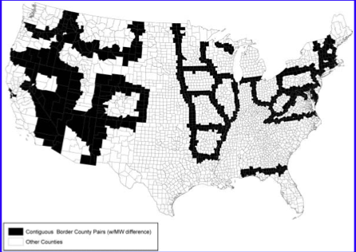
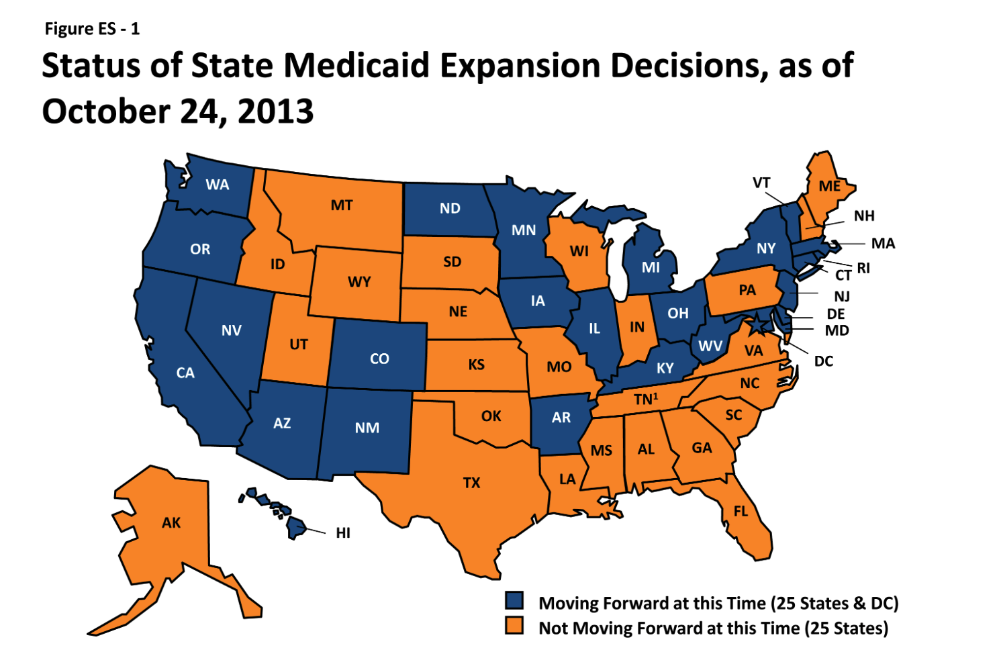
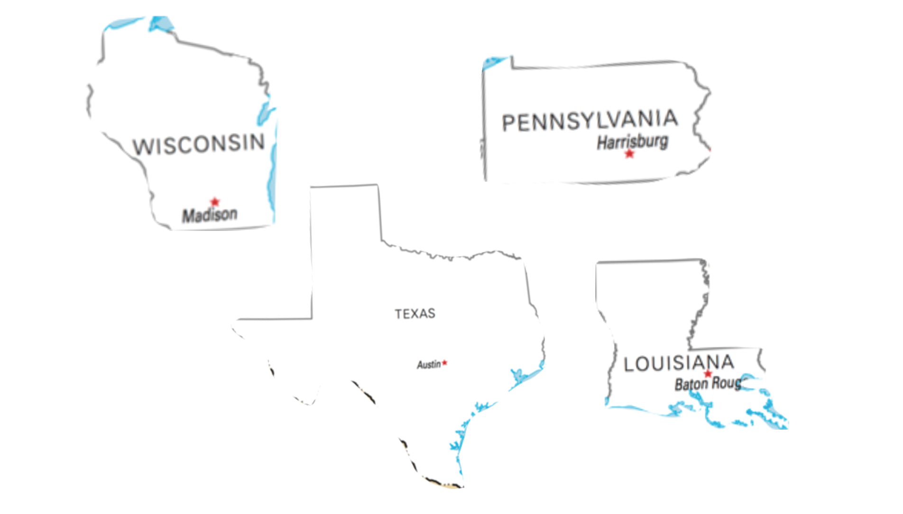

```{r}
#| label: setup

library(tidyverse)
library(fixest)
library(modelsummary)
library(patchwork)
library(fastDummies)

options(scipen = 999)

theme_set(theme_minimal(base_size = 16) +
          theme(plot.title = element_text(face = "bold", size = 18),
                plot.subtitle = element_text(size = 13, color = "gray40"),
                panel.grid.minor = element_blank()))
```


## Econometrics So Far

- Started with the "gold standard" of causal inference: **RCTs**
- Then moved to **Multivariate OLS** and (even better) **fixed effects** with panel data
- Last time, started discussion on **DiD**: Using *control units* instead of *control variables*
- This time: more on DiD
  - Data-driven matching (IPW-DiD)
  - Dynamic DiD and event studies
  - Cluster-robust standard errors


# Data-Driven Matching


## The Importance of Choosing Good Controls

- As discussed last time:

- Your *causal estimate* (the **ATT**) is only as valid as your counterfactual!

- **Good Controls** $\rightarrow$ **Good Counterfactual** $\rightarrow$ **Good DiD Estimate**

- **Bad Controls** $\rightarrow$ **Bad Counterfactual** $\rightarrow$ **Bad DiD Estimate**


## One Method: Intuitive Selection of Controls {.smaller}

- Choosing controls based on institutional, geographic, or other pre-existing knowledge
- Example:
    - **Border Discontinuity:** Locales that are near each other, but separated by a jurisdictional border
        - **Parallel Trends Assumption:** Locales on one side of the border which experienced the event (the "treated" locales) would have had the same trend in outcomes as the locales on the other side of the border (the "control" locales)
        - Card and Krueger (1994): Compares counties in NJ which passed an increase in the minimum wage to "control" counties immediately next door in PA


## Dube, Lester, and Reich (2010)

- Dube, Lester, and Reich (2010) extend this idea to *all* counties on state borders which have different minimum wages

. . .

{fig-align="center"}


## Second Method: Data-Driven Selection of Controls {.smaller}

- An alternative: choose controls based on "data-driven" methods
- Use an algorithm to find "good" controls based on observable variables
- **The idea:** if units share observable variables, they probably also share unobservable variables

- There are *lots* of methods: synthetic controls, nearest-neighbors, propensity scores, etc.
- All share the same goal; they differ in the algorithm used
- We will focus on: **Inverse Propensity Score Weighted DiD (IPW-DiD)**


# IPW-DiD: Propensity Score Weighting


## IPW-DiD: The Example {.smaller}

- In 2014, many states expanded Medicaid eligibility under the ACA
- Suppose we want to estimate the **effect of the ACA expansion on health insurance coverage rates**
- The TWFE DiD estimator would be:

. . .

$$
y_{it} = \beta_0 + \beta_1(D_{it}) + \alpha_i + \tau_t + \mu_{it}
$$

. . .

where:

- $y_{it}$ is the uninsured rate in state $i$ in year $t$
- $D_{it}$ is the treatment indicator (= $1$ in treated state after 2014)
- $\alpha_i$ are state fixed-effects
- $\tau_t$ are time fixed-effects
- $\mu_{it}$ is the error term


## The Problem: Different Types of States

- States which expanded ACA are *very different* from those that did not
  - Different politics, different demographics, different incomes, etc.
- Using *all states* which did not implement ACA expansion as controls may give us a poor counterfactual
- In particular: if these characteristics also affect *trends* in uninsured rates, parallel trends will fail


```{r}
#| label: sim-data
#| output: false

# ==============================================================================
# Simulation: ACA Medicaid Expansion
# ==============================================================================
set.seed(8675309)

n_states <- 200
years <- 2010:2018
policy_year <- 2014
true_att <- -5.0

# Generate state characteristics
states <- tibble(
  state_id = 1:n_states,
  X1 = rnorm(n_states, mean = 0, sd = 1),
  X2 = rbinom(n_states, 1, 0.4),
  X3 = rnorm(n_states, mean = 12, sd = 3)
) |>
  mutate(
    linear_pred = -0.5 + 1.5 * X1 - 1.2 * X2 + 0.3 * (X3 - 12),
    prob_expand = plogis(linear_pred),
    is_expanded = rbinom(n(), 1, prob_expand)
  )

# Generate panel data
panel_data <- expand_grid(state_id = states$state_id, year = years) |>
  left_join(states, by = "state_id") |>
  mutate(
    post = if_else(year >= policy_year, 1, 0),
    treat_active = is_expanded * post,
    alpha_i = 15 + rnorm(n_states, 0, 2)[state_id],
    lambda_t = -0.5 * (year - 2010),
    trend_violation = (-0.8 * X1 + 0.5 * X2 - 0.2 * (X3 - 12)) * (year - 2010),
    epsilon = rnorm(n(), 0, 1.5),
    y0 = alpha_i + lambda_t + trend_violation + epsilon,
    y1 = y0 + true_att,
    uninsured_rate = if_else(treat_active == 1, y1, y0)
  )

panel_data <- panel_data |>
  mutate(treat_post = treat_active,
         dem_share = X1,
         region = X2,
         pov_rate = X3)

aca_exp_data <- panel_data |>
  select(state_id, year, is_expanded,
    post, treat_post,
    uninsured_rate,
    dem_share, region, pov_rate)
```


## ACA Expansion Map

{fig-align="center"}


## ACA Expansion: Non-Parallel Pre-Trends {.smaller}

```{r}
#| label: naive-trends

plot_data_naive <- panel_data |>
  group_by(year, is_expanded) |>
  summarize(mean_y = mean(uninsured_rate), .groups = 'drop') |>
  mutate(Group = if_else(is_expanded == 1, "Treated", "Control"))

ggplot(plot_data_naive, aes(x = year, y = mean_y, color = Group, linetype = Group)) +
  geom_line(linewidth = 1.2) +
  geom_point(size = 2.5) +
  geom_vline(xintercept = 2013.5, linetype = "dotted") +
  scale_color_manual(values = c("Control" = "#E69F00", "Treated" = "#0072B2")) +
  labs(x = "Year", y = "Mean Uninsured Rate (%)",
    title = "Expansion States vs. All Non-Expansion States",
    subtitle = "Generated using simulated data")
```

. . .

- We can see that states which expanded the ACA follow very different trends compared to all untreated states
- Pre-trends are clearly not parallel --- bad news for our DiD estimate!

## Choosing Better Control States {.smaller}

- We know that using *all* non-expansion states as controls is unwise
    - Violation of parallel trends $\rightarrow$ bad estimate
- So what can we do?
- Idea: use states which **should have** expanded the ACA **but didn't** as controls
- Why?
  - States which were highly likely to expand but didn't (due to some last-minute change, a fluke in the political process, etc.) are much more *similar* to states which did expand
  - Therefore, they are more likely to form a "good" counterfactual


## Estimating Propensity Scores {.smaller}

- How do we find which states were "more likely" to expand?
- Estimate the following model:

. . .

$$
P(D_{i} = 1 | x_1, ..., x_k) = G(\beta_0 + \beta_1(x_1) + ... + \beta_k(x_k) + \mu_{it})
$$

. . .

where:

- $D_{i} = 1$ is an indicator if a unit is in the treatment group (i.e., treated at any time)
- $P(D_{i} = 1 | x_1, ..., x_k)$ is the *probability of being in the treatment group conditional on $x$ variables*
- $G()$ is a non-linear function (usually estimated with **logit regression**)
- After estimating this regression, compute the *predicted probability of treatment,* $\hat{P_i}$, also called the **propensity score**


## From Predicted Probabilities to Weights {.smaller}

- We then compute the **inverse propensity weight** with:

. . .

$$
IPW_i = D_i + (1 - D_i)\frac{\hat{P_i}}{1 - \hat{P_i}}
$$

. . .

- Then, we use $IPW_i$ as *weights* in the standard TWFE DiD regression


## What Does This Formula Do? {.smaller}

- If a unit is **treated** ($D_i=1$): $IPW_i = 1$
- If a unit is **untreated** ($D_i=0$): $IPW_i = \frac{\hat{P_i}}{1 - \hat{P_i}}$
  - If the *predicted probability $\hat{P_i}$ is large*, then $IPW_i$ is large
  - If the *predicted probability $\hat{P_i}$ is small*, then $IPW_i$ is small

. . .

- In other words:
  - Untreated units that *look like* they should have been treated (but didnt't) get **a lot of weight** as a control
  - Untreated units that look *nothing like* treated units get **very little weight** as a control
  - All treated units get weight of $1$


## Propensity Score Example {.smaller}

- Whether or not a state extends the ACA is probably a function of (at least):
  - Democratic vote share, region, and poverty rates
    - Democrats more likely to support expansion; states with higher poverty rates also more likely to support it; if nearby states pass it so will others

- So we can write:

. . .

$$
P(D_i = 1) = G(\beta_0 + \beta_1(dem\_votes_i) + \beta_2(region_i) + \beta_3(poverty_i))
$$

. . .

- Estimated propensity scores ($\hat{P_i}$) and IPW weights ($IPW_i$) look like:

. . .

| State | Status | $\hat{P_i}$ | $IPW_i$ |
|:-----:|:------:|:-----------:|:-------:|
| MI    | Treated | 0.91 | 1.00 |
| WI    | Control | 0.87 | **6.69** |
| TX    | Control | 0.16 | 0.19 |
| PA    | Control | 0.79 | **3.76** |
| MA    | Treated | 0.98 | 1.00 |
| LA    | Control | 0.28 | 0.38 |


## Control Set with Equal Weights

- Without IPW, all control states get equal weight --- regardless of how similar they are to treated states

. . .

{fig-align="center"}


## Control Set with IPW Weights

- With IPW, control states that *look like* treated states (WI, PA) get much larger weight

. . .

{fig-align="center"}


## What the Weights Do {.smaller}

- Control states like **WI** and **PA** --- which have a high probability of treatment *but don't get treated* --- get much higher weights in the TWFE regression

- Control states like **TX** and **LA** --- which have a low probability of treatment --- get very little weight

- Effect: build a weighted control group that is observably similar to the treated group

. . .

::: {.callout-important}
## Key Point
IPW upweights control units which *almost* got treated and downweights control units which were never going to be treated. This builds a better counterfactual.
:::


## Let's Implement This Step-by-Step {.smaller}

- In the simulated data, the **true effect** of expansion is a $-5$ point drop in the uninsured rate

**Step 1:** Estimate the naive TWFE DiD (all controls, equal weight)

```{r}
#| echo: true

did_naive <- feols(uninsured_rate ~ treat_post | state_id + year,
                   vcov = "HC1",
                   data = aca_exp_data)

summary(did_naive)
```

. . .

- The coefficient suggests a $\approx 11$ ppt reduction in the uninsured rate
- The estimate is roughly *twice as large* as it should be.


## Step 2: Aggregate Data & Estimate Propensity Scores {.smaller}

- It's usually a good idea to estimate propensity scores on *just pre-treatment periods*

. . .

```{r}
#| echo: true

agg_state_data <- aca_exp_data |>
  filter(post == 0) |>
  group_by(state_id, is_expanded) |>
  summarize(pretreat_dem_share = mean(dem_share, na.rm = T),
    pretreat_region = mean(region, na.rm = T),
    pretreat_pov_rate = mean(pov_rate, na.rm = T)
  ) |>
  ungroup()

logit_treatment <- glm(
  is_expanded ~ pretreat_dem_share + pretreat_region + pretreat_pov_rate,
  data = agg_state_data, family = binomial("logit"))
```

## Step 2.5: Examine Predictive Model {.smaller}

```{r}
#| echo: true

summary(logit_treatment)

```

## Step 3: Get Predicted Probabilities & Compute IPW {.smaller}

```{r}
#| echo: true

# Get predicted probabilities (propensity scores)
agg_state_data <- agg_state_data |>
  mutate(pred_prob = predict(logit_treatment, type = "response"))

# Compute IPW weights
agg_state_data <- agg_state_data |>
  mutate(ipw = case_when(
    is_expanded == 1 ~ 1,
    is_expanded == 0 ~ pred_prob / (1 - pred_prob)
  ))

# Merge weights into panel data
aca_exp_data <- aca_exp_data |>
  left_join(agg_state_data |>
    select(state_id, is_expanded, pred_prob, ipw),
    by = c("state_id", "is_expanded"))
```


## Check Propensity Score Overlap {.smaller}

- We need treated and control propensity scores to **overlap**
  - Need untreated units with high predicted probability; treated units some variation in predicted probability

. . .

```{r}
ggplot(agg_state_data, aes(x = pred_prob, fill = factor(is_expanded))) +
  geom_histogram(bins = 25, alpha = 0.6, position = "identity", color = "white") +
  scale_fill_manual(values = c("0" = "#E69F00", "1" = "#0072B2"),
                    labels = c("Control", "Treated")) +
  labs(x = "Estimated Propensity Score", y = "Count",
    title = "Propensity Score Distributions by Treatment Status",
    subtitle = "Good overlap means we can find comparable control units",
    fill = NULL)
```


## Step 4: Estimate IPW-Weighted TWFE DiD {.smaller}

- Use the `weights` argument from `feols()` to weight the control units in the regression

. . .

```{r}
#| echo: true

did_ipw <- feols(uninsured_rate ~ treat_post | state_id + year,
                 vcov = "HC1",
                 weights = ~ipw,
                 data = aca_exp_data)

summary(did_ipw)
```

. . .

- Now we get an estimated treatment effect of $\approx -6$ ppts --- much closer to the true effect of $-5$!


## Comparing Naive vs. IPW: The Trends {.smaller}

```{r}
plot_data_ipw <- aca_exp_data |>
  group_by(year, is_expanded) |>
  summarize(mean_y = weighted.mean(uninsured_rate, w = ipw), .groups = 'drop') |>
  mutate(type = "IPW-Weighted", Group = if_else(is_expanded == 1, "Treated", "Control"))

plot_data_naive_f <- plot_data_naive |>
  mutate(type = "Naive (Unweighted)")

plot_both <- bind_rows(plot_data_naive_f, plot_data_ipw)

ggplot(plot_both, aes(x = year, y = mean_y, color = Group, linetype = Group)) +
  geom_line(linewidth = 1.1) +
  geom_point(size = 2) +
  geom_vline(xintercept = 2013.5, linetype = "dotted") +
  facet_wrap(~type) +
  scale_color_manual(values = c("Treated" = "#0072B2", "Control" = "#E69F00")) +
  labs(x = "Year", y = "Mean Uninsured Rate (%)",
    title = "Naive vs. IPW-Weighted Trends",
    subtitle = "IPW reweighting brings pre-trends into alignment")
```


## Comparing Naive vs. IPW: The Estimates {.smaller}

```{r}
tibble(
    Method = c("Naive DiD (all controls, equal weight)", "IPW-Weighted DiD"),
    Estimate = c(coef(did_naive)["treat_post"], coef(did_ipw)["treat_post"]),
    `95% CI Lower` = c(confint(did_naive)["treat_post", 1], confint(did_ipw)["treat_post", 1]),
    `95% CI Upper` = c(confint(did_naive)["treat_post", 2], confint(did_ipw)["treat_post", 2]),
    `True Effect` = c(-5, -5)
) |>
    knitr::kable(digits = 2)
```

. . .

- The naive 95% CI doesn't even contain the true effect of $-5$!
- The IPW estimate is much closer to the truth, and its CI covers $-5$


## IPW-DiD: Key Takeaways {.smaller}

- DiD assumes parallel trends. This often fails if treated and control units are systematically different

- IPW puts more weight on controls which were **highly likely to be treated but were not** --- they are more similar to the treated units

- **The Algorithm:**
  1. Estimate predicted probability of treatment (propensity score) using pre-treatment data
  2. Compute IPW from predicted probabilities and treatment status
  3. Use IPW as weights in TWFE DiD regression

. . .

::: {.callout-important}
Your IPW-DiD estimate is only as good as your predictive model! If you leave out an important confounder, bias remains.
:::


# Dynamic DiD


## Introduction to Dynamic DiD

- TWFE models can be extended to estimate **separate** treatment effects for each post-treatment period
  - If treatment occurs in 2015, and we observe data for 2016, 2017, and 2018, we can estimate a different treatment effect for each year
- Why might we want to do this?
  - Maybe the treatment effect **grows** a few years after a policy comes into effect
  - Or maybe it **diminishes** over time

- **Dynamic DiD** regressions allow us to estimate these period-by-period treatment effects


## Relative Time

- Dynamic DiD models are estimated using **relative time**
- **Relative time:** the number of time periods since the event occurred
- If an event occurs in 2015:
  - For **2015, 2016, 2017, ...**, relative time is **0, 1, 2, ...**
  - For **..., 2012, 2013, 2014**, relative time is **..., -3, -2, -1**


## The Dynamic DiD Model {.smaller}

- The general dynamic DiD model is:

. . .

$$
y_{it} = \sum_{j=-J}^{-2}\beta_jD_{it} + \sum_{k=0}^{K}\beta_kD_{it}  + \alpha_i + \tau_t + \mu_{it}
$$ {#eq-dyn-did}

. . .

where:

- $y_{it}$, $\alpha_i$, $\tau_t$, and $\mu_{it}$ are the same as in our TWFE model
- $D_{kit}$ are dummy variables which equal $1$ if the unit is treated AND the relative time is $k$, and $0$ otherwise
- **Important:** We **omit** the dummy for $k=−1$ (the period just before treatment) as the reference category
- The $\hat{\beta_k}$ coefficients trace out the effect of the policy over the post-treatment period *relative* to $k=−1$
- The $\hat{\beta_j}$ coefficients trace out the "effect" of the policy over the pre-treatment period *relative* to $k=−1$

## Why Omit $k=-1$? {.smaller}

- Same reason we omit a reference category with any set of dummy variables --- to avoid perfect collinearity (the "dummy variable trap")
- We choose $k=-1$ because it's the natural baseline:
  - All estimates are then interpreted as the treatment effect *relative to the period just before treatment*
  - $\hat{\beta}_0$: effect in the year of treatment relative to the year before
  - $\hat{\beta}_1$: effect one year after treatment relative to the year before
  - $\hat{\beta}_{-3}$: "effect" three years before treatment relative to the year before (should be $\approx 0$!)


## Example Data Structure {.smaller}

- In a normal DiD, we have a single `treat_post` column
- In dynamic DiD, we replace it with a **dummy for each relative time period** interacted with treatment

. . .

```{r}
#| echo: false

did_ex_tab <- tibble(unit_id = rep(1:4, 5),
  year = c(rep(2014, 4), rep(2015, 4), rep(2016, 4), rep(2017, 4), rep(2018, 4)),
  treatment_group = rep(c(1, 1, 0, 0), 5),
  adoption_year = 2016 * treatment_group,
  post = case_when(year >= adoption_year & adoption_year > 0 ~ 1, TRUE ~ 0),
  treat_post = treatment_group * post
)

did_ex_tab <- did_ex_tab |>
  mutate(rel_t = year - 2016,
  rel_t_treat = case_when(treatment_group == 1 ~ rel_t, TRUE ~ 0))

did_ex_tab <- dummy_cols(did_ex_tab, select_columns = "rel_t_treat", remove_selected_columns = TRUE)

did_ex_tab <- did_ex_tab |>
  mutate(rel_t_treat_0 = rel_t_treat_0 * treatment_group) |>
  arrange(unit_id, rel_t)

as.data.frame(
  did_ex_tab |> select(unit_id, year, treatment_group, starts_with("rel_t_treat"))
)
```


## Dynamic DiD Example {.smaller}

- Suppose we want to estimate the effect of an *environmental policy* on manufacturing employment
- Assume the effect of this policy *increases* over time
- We have data on 50 cities:
  - 25 of these cities enacted the policy in 2005 ("treated" cities)
  - 25 did not ("control" cities)
  - We observe all 50 cities from 1995 to 2010

```{r}
#| label: sim-env
#| output: false

set.seed(456)
n_cities <- 50
years_e <- 1995:2010
TREATMENT_YEAR <- 2005

panel_env <- expand.grid(city_id = 1:n_cities, year = years_e)

control_cities <- sample(1:n_cities, 25)
city_lookup <- data.frame(city_id = 1:n_cities) |>
  mutate(
    treated_group = ifelse(city_id %in% control_cities, 0, 1),
    adoption_year = ifelse(treated_group == 1, TREATMENT_YEAR, Inf)
  )

get_true_effect <- function(relative_year) {
  case_when(
    relative_year < 0 ~ 0,
    relative_year == 0 ~ -100,
    relative_year == 1 ~ -300,
    relative_year == 2 ~ -450,
    relative_year >= 3 ~ -500
  )
}

city_fes <- rnorm(n_cities, 1000, 150)
year_fes <- rnorm(length(years_e), 50, 20)

final_simulated_data <- panel_env |>
  left_join(city_lookup, by = "city_id") |>
  mutate(
    city_fe = city_fes[city_id],
    year_fe = year_fes[year - min(years_e) + 1],
    relative_year = year - adoption_year,
    true_effect = get_true_effect(relative_year),
    manufacturing_emp = city_fe + year_fe + true_effect + rnorm(n(), 0, 50)
  ) |>
  select(city_id, year, treated_group, adoption_year, manufacturing_emp)

final_simulated_data <- final_simulated_data |>
  mutate(post = case_when(year >= 2005 ~ 1, TRUE ~ 0),
    treat_post = treated_group * post,
    rel_t = year - 2005,
    rel_t_treat = case_when(treated_group == 1 ~ rel_t, TRUE ~ 0))

final_simulated_data <- dummy_cols(final_simulated_data,
  select_columns = "rel_t_treat", remove_selected_columns = TRUE)

final_simulated_data <- final_simulated_data |>
  mutate(rel_t_treat_0 = rel_t_treat_0 * treated_group)
```


## Raw Trends: Treated vs. Control Cities {.smaller}

```{r}
env_trends <- final_simulated_data |>
  group_by(year, treated_group) |>
  summarize(mean_emp = mean(manufacturing_emp), .groups = 'drop') |>
  mutate(Group = if_else(treated_group == 1, "Treated Cities", "Control Cities"))

ggplot(env_trends, aes(x = year, y = mean_emp, color = Group)) +
  geom_line(linewidth = 1.2) +
  geom_point(size = 2.5) +
  geom_vline(xintercept = 2004.5, linetype = "dashed", color = "gray40") +
  annotate("text", x = 2004.3, y = 1150, label = "Policy\nAdopted", hjust = 1, size = 4) +
  scale_color_manual(values = c("Control Cities" = "#E69F00", "Treated Cities" = "#0072B2")) +
  labs(x = "Year", y = "Mean Manufacturing Employment",
    title = "Manufacturing Employment: Treated vs. Control Cities",
    subtitle = "Parallel pre-trends, then growing divergence after 2005")
```

::: aside
Note: figure generated using simulated data. True effects: $-100$ at $k=0$, growing to $-500$ by $k=3$.
:::


## Estimating the Dynamic Model {.smaller}

```{r}
#| echo: true

dyn_did <- feols(manufacturing_emp ~ `rel_t_treat_-10` + `rel_t_treat_-9` +
    `rel_t_treat_-8` + `rel_t_treat_-7` + `rel_t_treat_-6` +
    `rel_t_treat_-5` + `rel_t_treat_-4` + `rel_t_treat_-3` +
    `rel_t_treat_-2` + `rel_t_treat_0` + `rel_t_treat_1` +
    `rel_t_treat_2` + `rel_t_treat_3` + `rel_t_treat_4` +
    `rel_t_treat_5` |
    city_id + year,
    vcov = "HC1",
    data = final_simulated_data)
```

- Note: `rel_t_treat_-1` (the period right before treatment) is **omitted** as the reference category
- Each coefficient = treatment effect at that relative time, compared to $k = -1$
- Alternatively, can make the `rel_t_treat` variable a factor and set the reference level to `-1`


## Interpreting the Results {.smaller}

```{r}
#| echo: true

summary(dyn_did)
```


## Interpreting the Coefficients {.smaller}

Each $\hat{\beta}_k$ is the estimated treatment effect at relative time $k$, **relative to $k = -1$**

- $\hat{\beta}_{-3} \approx -30$: Three years before adoption, treated cities had 30 less manufacturing jobs than control cities *compared to one year before adoption*. Not statistically different from zero $\rightarrow$ no pre-trend.

- $\hat{\beta}_0 \approx -118$: In the adoption year, treated cities lost about 180 manufacturing jobs relative to control cities *compared to one year before adoption*. Statistically significant!

- $\hat{\beta}_3 \approx -500$: Three years after adoption, the gap had grown to about 500 fewer jobs. Statistically significant!

. . .

**Key points:**

- The coefficients are *not* the level of employment --- they are *differences* between treated and control, benchmarked to the period just before the policy

- If $\hat{\beta}_{-5} = 0$ and $\hat{\beta}_{-2} = 0$ but $\hat{\beta}_0 = -100$, that's the pattern we want: nothing happening pre-treatment, then a break at the policy date

- The confidence intervals tell you whether each coefficient is statistically distinguishable from zero


## Pre-Treatment Results and Parallel Trends {.smaller}

- Why do we estimate effects *before* the policy occurs?
- Because this is a **test of our key DiD assumption: parallel trends**

. . .

- Think about what $\hat{\beta}_{-3}$ measures: the gap between treated and control groups at $k = -3$ relative to their gap at $k = -1$
- If both groups were on the same trajectory before the policy, this gap should not have been changing $\rightarrow$ $\hat{\beta}_{-3} \approx 0$
- If $\hat{\beta}_{-3}$ is large and statistically significant, the groups were drifting apart *before* the policy even existed
  - Any post-treatment divergence might just be a continuation of that pre-existing trend

. . .

- Here, our pre-treatment coefficients are close to zero: **good evidence for parallel trends**


## The Event-Study Plot {.smaller}

- Often, it is hard to read that many coefficients, so we plot them as an **event-study plot**
- We plot each coefficient (setting $k=-1$ to $0$) with its 95% confidence interval

. . .

```{r}
#| echo: true
#| output-location: slide

est_tab <- as_tibble(dyn_did$coeftable) |>
  rownames_to_column(var = "coefname") |>
  mutate(
    est = Estimate,
    ci95_l = confint(dyn_did)[,1],
    ci95_u = confint(dyn_did)[,2],
    rel_t = c(-10:-2, 0:5))

omitted_lvl <- tibble(coefname = "ref", rel_t = -1, est = 0,
  ci95_l = 0, ci95_u = 0, Estimate = 0)

est_tab <- est_tab |>
  bind_rows(omitted_lvl) |>
  arrange(rel_t)

ggplot(data = est_tab) +
  geom_hline(yintercept = 0, linetype = "solid", color = "gray60") +
  geom_vline(xintercept = -0.5, linetype = "dashed", color = "gray40") +
  geom_errorbar(aes(x = rel_t, ymin = ci95_l, ymax = ci95_u),
    width = 0.2, color = "#0072B2", linewidth = 0.8) +
  geom_point(aes(x = rel_t, y = est), size = 3, color = "#0072B2") +
  geom_line(aes(x = rel_t, y = est), color = "#0072B2", linewidth = 0.8) +
  coord_cartesian(ylim = c(-700, 300)) +
  scale_x_continuous(breaks = seq(-10, 5, 1)) +
  labs(x = "Years Relative to Policy Adoption",
    y = "Estimated Effect on Employment",
    title = "Event Study: Environmental Policy & Manufacturing Employment",
    subtitle = "Reference period: k = -1 (one year before adoption)")
```


## Reading the Event Study Plot

- **Left of the dashed line** (pre-treatment, $k < -1$):
  - Coefficients are near zero, confidence intervals include zero
  - i.e., no statistically significant difference between treatment and control groups prior to treatment
  - $\rightarrow$ No evidence of pre-trends; parallel trends looks plausible

- **Right of the dashed line** (post-treatment, $k \geq 0$):
  - Coefficients become large and negative, growing over time
  - $\rightarrow$ The causal effect of the policy, unfolding over time

. . .

::: {.callout-warning}
If you saw significant pre-treatment coefficients: **red flag!** Your control group is probably not valid
:::


## A Warning: Staggered Adoption {.smaller}

- Our example was "simple": all treated cities adopted the policy in the same year (2005)
- This is called **simultaneous adoption**
- What if units are treated in different years? (e.g., some cities in 2005, others in 2007, more in 2010)
- This is **staggered adoption**

. . .

::: {.callout-warning}
The simple TWFE dynamic DiD model can be very biased under staggered adoption. The problem is that TWFE implicitly uses already-treated units as controls for later-treated units, creating "negative weights" on some treatment effects. If you have staggered adoption, you need different methods (e.g., the Callaway-Sant'Anna estimator in the `did` package).
:::


## Dynamic DiD: Key Takeaways

1. Dynamic DiD estimates treatment effects that **evolve over time**

2. The model uses **relative time** ($k$), not calendar time

3. We **omit** $k=−1$ (period just before treatment) as the reference category

4. Pre-treatment coefficients ($k < -1$) test the **parallel trends** assumption --- they should all be $\approx 0$

5. Present your results using an **event study plot**

6. The simple TWFE model **fails under staggered adoption**


# Cluster-Robust Standard Errors


## The Core Problem: An Intuitive Example

- Imagine you want to know the average height of 5th graders in a city

- You have two sampling options:

- **Plan A (Simple Random Sample):** Randomly select 1,000 students from every school in the city

- **Plan B (Cluster Sample):** Randomly select 40 classrooms and measure all 25 students in each

- Both plans give you $N = 1{,}000$ observations. But are they the same?

- **No!** In Plan B, students in the same class are more similar to each other (shared teacher, neighborhood, etc.). They are not *independent!*


## What is a "Cluster"?

- A **cluster** is a group of observations that are more similar to each other than to observations in other groups

- Errors from our regression are *correlated within the cluster*

- But Errors from our regression are still *independent between clusters*

. . .

| Individual unit ($n$) | Cluster ($G$) |
|:-------------------:|:-----------:|
| Students            | Classroom   |
| Person              | State (or county) |
| City                | State       |
| Firms               | Industry    |

- Why is this a problem for our standard errors?


## The Statistical Violation {.smaller}

- This is a violation of our **Gauss-Markov** Assumptions
- If one student in a class has a higher *error term*, her other classmates probably do too
- Knowing one error tells you something about another error $\rightarrow$ correlated errors within each cluster

. . .

- Just like **heteroskedasticity**, clustered errors will **not bias** your coefficient estimate $\hat{\beta}$
- However, it will lead to an (often very large) **underestimation** of our "true" standard errors


## What Happens When Standard Errors Are Too Small? {.smaller}

- If our standard errors are too small:
  - Our t-statistics are too big
  - Our p-values are too small
  - Our confidence intervals are too narrow

. . .

- This leads to **Type I Errors (False Positives)**

- **Type I Error:** You conclude there is an effect when, in reality, there is no effect

- We usually accept a 5% false positive rate (i.e., $\alpha = 0.05$)

- When we ignore clustering, our actual Type I error rate might be 20%, 30%, or even 50%...

- ...all while R tells us the p-value is 0.03!


## Simulation: Setup {.smaller}

- Let's see how bad this problem gets with a simulation
- We generate data where the **true treatment effect is zero**, so *any* rejection of $H_0$ is a **Type I error**

. . .

**Simulation parameters:**

| Parameter | Value | Meaning |
|:----------|:-----:|:--------|
| Number of clusters ($G$) | 50 | e.g., 50 classrooms |
| Observations per cluster | 30 | e.g., 30 students per classroom |
| Total observations ($N$) | 1,500 | $50 \times 30$ |
| ICC | 0.5 | 50% of the variation in $y$ is between clusters |
| True treatment effect | **0** | Treatment does *nothing* |
| Number of simulations | 1,000 | We repeat the experiment 1,000 times |


## What Does Clustered Data Look Like? {.smaller}

- Here is one draw from our simulation (showing 8 clusters for clarity)
- Each color = a different cluster; observations within a cluster share a common error component

. . .

```{r}
#| label: cluster-scatter

set.seed(12345980)

# Generate one draw for visualization (fewer clusters for readability)
n_show <- 8
obs_show <- 30
icc_show <- 0.5

cluster_var <- icc_show
indiv_var <- 1 - icc_show

viz_data <- tibble(
  cluster_id = rep(1:n_show, each = obs_show),
  cluster_error = rep(rnorm(n_show, 0, sqrt(cluster_var)), each = obs_show),
  treatment = rep(rbinom(n_show, 1, 0.5), each = obs_show),
  individual_error = rnorm(n_show * obs_show, 0, sqrt(indiv_var)),
  x = runif(n_show * obs_show, 0, 10),
  y = 5 + 0 * treatment + cluster_error + individual_error
)

ggplot(viz_data, aes(x = x, y = y, color = factor(cluster_id))) +
  geom_point(size = 2.5, alpha = 0.7) +
  geom_hline(data = viz_data |> group_by(cluster_id) |> summarize(mean_y = mean(y)),
             aes(yintercept = mean_y, color = factor(cluster_id)),
             linetype = "dashed", alpha = 0.5) +
  scale_color_brewer(palette = "Set2") +
  labs(x = "X", y = "Y",
    title = "Clustered Data: Observations Within Groups Are Correlated",
    subtitle = "Dashed lines = cluster means; dots of the same color tend to bunch together",
    color = "Cluster")
```

- Notice: observations of the same color cluster around the same value of $y$
- OLS treats all 1,500 dots as independent --- but dots of the same color are *not* independent!


## Simulation: Running 1,000 Experiments {.smaller}

- For each of 1,000 simulated datasets (50 clusters $\times$ 30 obs, true effect = 0):
  1. Run OLS: `feols(y ~ treatment)`
  2. Get p-value using **naive (iid)** standard errors
  3. Get p-value using **HC1 (heteroskedasticity-robust)** standard errors --- the fix we've been using all semester
  4. Check: did we reject $H_0$ at $\alpha = 0.05$? (Any rejection is a **Type I error**!)

```{r}
#| label: cluster-sim

set.seed(12345980)
NUM_SIMS <- 1000
NUM_CLUSTERS <- 50
OBS_PER_CLUSTER <- 30
ICC <- 0.5
TRUE_EFFECT <- 0.0

generate_clustered_data <- function(n_clust, n_obs, icc, true_effect) {
  total_error_var <- 1
  cluster_error_var <- icc * total_error_var
  individual_error_var <- (1 - icc) * total_error_var

  cluster_id <- 1:n_clust
  cluster_error <- rnorm(n = n_clust, mean = 0, sd = sqrt(cluster_error_var))
  treatment <- rbinom(n = n_clust, size = 1, prob = 0.5)

  clusters <- data.frame(cluster_id, cluster_error, treatment)
  df <- clusters[rep(clusters$cluster_id, each = n_obs), ]
  df$individual_error <- rnorm(n = nrow(df), mean = 0, sd = sqrt(individual_error_var))
  df$y <- 5 + (true_effect * df$treatment) + df$cluster_error + df$individual_error

  return(df)
}

run_trial <- function() {
  sim_data <- generate_clustered_data(NUM_CLUSTERS, OBS_PER_CLUSTER, ICC, TRUE_EFFECT)
  model <- feols(y ~ treatment, data = sim_data)

  naive_p <- summary(model, se = "iid")$coeftable["treatment", "Pr(>|t|)"]
  hc1_p <- summary(model, vcov = "HC1")$coeftable["treatment", "Pr(>|t|)"]
  cluster_p <- summary(model, cluster = ~cluster_id)$coeftable["treatment", "Pr(>|t|)"]

  return(c(naive_p = naive_p, hc1_p = hc1_p, cluster_p = cluster_p))
}

results <- t(replicate(NUM_SIMS, run_trial()))
alpha <- 0.05
naive_rej <- mean(results[, "naive_p"] < alpha)
hc1_rej <- mean(results[, "hc1_p"] < alpha)
cluster_rej <- mean(results[, "cluster_p"] < alpha)
```


## Results: Naive OLS and HC1 {.smaller}

```{r}
cat("--- Type I Error Rate (Expected: 5%) ---\n\n")
cat(sprintf("1. Naive (iid) Standard Errors:              %.1f%%\n", naive_rej * 100))
cat(sprintf("2. Heteroskedasticity-Robust (HC1) Errors:   %.1f%%\n", hc1_rej * 100))
```

. . .

- Naive OLS: **massive** over-rejection. We are committing Type I errors far more than 5% of the time
- HC1 (our usual `vcov = "HC1"` fix): still way too many false positives!
  - HC1 corrects for *heteroskedasticity* but **not** for *within-cluster correlation*
- Neither of our usual standard error approaches works here. We need something new.


## Visualizing the Problem {.smaller}

```{r}
results_long_pre <- as_tibble(results) |>
  select(naive_p, hc1_p) |>
  pivot_longer(everything(), names_to = "method", values_to = "pvalue") |>
  mutate(method = case_when(
    method == "naive_p" ~ "Naive (iid) SEs",
    method == "hc1_p" ~ "HC1 (Heteroskedasticity-Robust) SEs"
  ))

ggplot(results_long_pre, aes(x = pvalue, fill = method)) +
  geom_histogram(bins = 20, alpha = 0.7, color = "white") +
  geom_vline(xintercept = 0.05, linetype = "dashed", color = "red") +
  facet_wrap(~method) +
  annotate("text", x = 0.15, y = 150, label = "alpha == 0.05", parse = TRUE,
           color = "red", size = 4) +
  scale_fill_manual(values = c("Naive (iid) SEs" = "#E69F00",
                                "HC1 (Heteroskedasticity-Robust) SEs" = "#D55E00")) +
  labs(x = "P-Value", y = "Count",
    title = "P-Value Distributions Under the Null (True Effect = 0)",
    subtitle = sprintf("Naive Type I error rate: %.0f%% | HC1 Type I error rate: %.0f%%",
                      naive_rej * 100, hc1_rej * 100)) +
  theme(legend.position = "none")
```

- Under $H_0$, p-values should be uniformly distributed (flat histogram)
- Both naive and HC1: p-values pile up near zero $\rightarrow$ way too many Type I errors


## The Solution: Cluster-Robust Standard Errors {.smaller}

- **Cluster-Robust Standard Errors (CRSEs)** are designed for exactly this problem
- They allow for correlated errors *within* each cluster, while still assuming independence *between* clusters

. . .

- The formula is too involved for this class, but the intuition:
  1. Compute the regression residuals ($\hat{y}_i - y_i$)
  2. Look at how much correlation exists *within each cluster group*
  3. Compute an "effective" sample size based on the number of independent clusters
  4. Adjust the standard errors to reflect the *effective* sample size

. . .

- **Rule-of-Thumb:** Your "effective sample size" becomes closer to the number of clusters ($G$), not the number of observations ($N$)
  - In our simulation: $N = 1{,}500$ observations, but effectively only $G = 50$ independent pieces of information


## CRSEs in R {.smaller}

- With `fixest`, implementing CRSEs is easy
- Instead of `vcov = "HC1"`, use `cluster = "your_cluster_var"`

. . .

```{r}
#| echo: true
#| eval: false

# Naive standard errors (WRONG with clustered data)
model <- feols(y ~ treatment, data = my_data, vcov = "iid")

# Heteroskedasticity-robust (ALSO WRONG with clustered data)
model <- feols(y ~ treatment, data = my_data, vcov = "HC1")

# Cluster-robust standard errors (CORRECT)
model <- feols(y ~ treatment, data = my_data, cluster = "cluster_id")
```

. . .

- The researcher must decide what the clusters are:
  - **General rule: cluster at the level of treatment assignment**
  - State-level policy $\rightarrow$ cluster by state
  - School-level program $\rightarrow$ cluster by school


## Now Let's See If CRSEs Fix the Problem {.smaller}

```{r}
cat("--- Type I Error Rate (Expected: 5%) ---\n\n")
cat(sprintf("1. Naive (iid) Standard Errors:              %.1f%%\n", naive_rej * 100))
cat(sprintf("2. Heteroskedasticity-Robust (HC1) Errors:   %.1f%%\n", hc1_rej * 100))
cat(sprintf("3. Cluster-Robust Standard Errors:           %.1f%%\n", cluster_rej * 100))
```

. . .

- Naive and HC1: Type I error rates far above 5%
- **Cluster-robust SEs: close to the target 5%!**
- CRSEs are the *only* approach that properly accounts for within-cluster correlation


## Visualizing All Three Approaches {.smaller}

```{r}
results_long_all <- as_tibble(results) |>
  pivot_longer(everything(), names_to = "method", values_to = "pvalue") |>
  mutate(method = case_when(
    method == "naive_p" ~ "1. Naive (iid)",
    method == "hc1_p" ~ "2. HC1 (Heteroskedastic-Robust)",
    method == "cluster_p" ~ "3. Cluster-Robust"
  ))

ggplot(results_long_all, aes(x = pvalue, fill = method)) +
  geom_histogram(bins = 20, alpha = 0.7, color = "white") +
  geom_vline(xintercept = 0.05, linetype = "dashed", color = "red") +
  facet_wrap(~method, ncol = 3) +
  annotate("text", x = 0.2, y = 140, label = "alpha == 0.05", parse = TRUE,
           color = "red", size = 3.5) +
  scale_fill_manual(values = c("1. Naive (iid)" = "#E69F00",
                                "2. HC1 (Heteroskedastic-Robust)" = "#D55E00",
                                "3. Cluster-Robust" = "#0072B2")) +
  labs(x = "P-Value", y = "Count",
    title = "P-Value Distributions Under the Null (True Effect = 0)",
    subtitle = sprintf("Type I error rates --- Naive: %.0f%% | HC1: %.0f%% | Cluster-Robust: %.0f%%",
                      naive_rej * 100, hc1_rej * 100, cluster_rej * 100)) +
  theme(legend.position = "none")
```

- Only cluster-robust SEs produce a (roughly) uniform distribution of p-values


## CRSEs in the ACA Example {.smaller}

- Can easily tell `feols()` to use clustered standard errors (and at what level) using the `cluster = cluster_level` argument

. . .

```{r}
#| echo: true

did_crse <- feols(uninsured_rate ~ treat_post | state_id + year,
                   cluster = "state_id",
                   data = aca_exp_data)

summary(did_crse)
```

- The coefficient is unchanged (clustering does not affect the point estimate)
- But the standard error is *larger*, giving wider confidence intervals and larger p-values


## Choosing the Right Cluster Level {.smaller}

- So, *like* heteroskedastic robust SEs, easy to correct for
- But *unlike* heteroskedastic robust SEs, we have to choose how we think the clusters are defined
  - This is trickier than it seems:
    - City data: cluster at the city-level? State-level? County?
    - Individual data: hospital-level? County-level?
  - **General rule: cluster at the level of treatment**
    - Studying state-level policies? Cluster by state
- You generally need at least 20 clusters for CRSEs to work well
- When in doubt, cluster at a broader level (e.g., state rather than county) --- this will usually result in more conservative SEs


## CRSEs: Key Takeaways

- **Clustering is everywhere:** Data often comes in groups (classrooms, states, individuals over time)

- **Ignoring it is dangerous:** It leads to a massive inflation of **Type I errors** (false positives)

- **Use cluster-robust standard errors:** They provide reliable inference by relaxing the independence assumption

- **Cluster at the level of treatment assignment** (e.g., state-level policy $\rightarrow$ cluster by state)

- You generally need at least 30--50 clusters for CRSEs to work well

